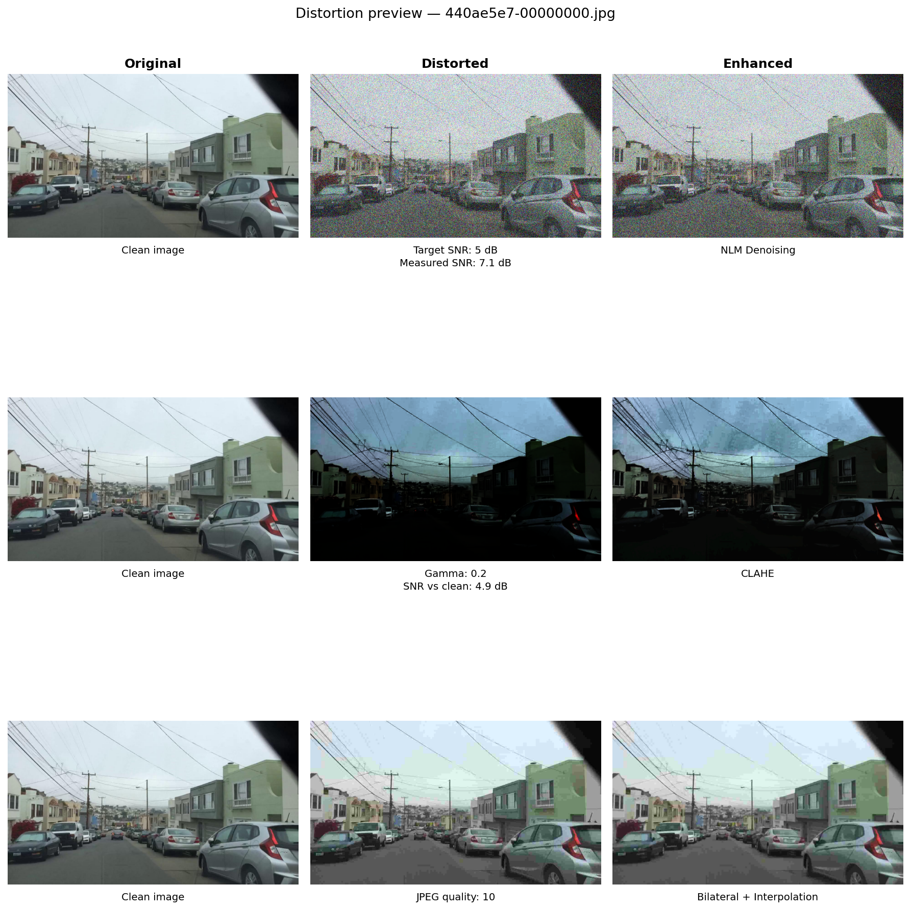

# Robustness of Vision Algorithms Under Image Degradations
## Digital Image Processing — Course Project Presentation

**Authors:** Nadav Moshe, Alon Ron  
**Semester:** 2025–2026

---

## Slide 1 — Title

**Robustness of Vision Algorithms Under Image Degradations**

- BDD100K driving scenes
- Three distortions × four intensity levels
- ORB · YOLOv8n · SegFormer-b0

---

## Slide 2 — Motivation

- Autonomous driving sees **noise, low light, compression** before perception runs
- Question: **classical restoration** vs **model adaptation**?
- Controlled experiment: clean → distort → restore or fine-tune → measure

---

## Slide 3 — Research Question

> When dashcam images degrade, do classical pre-processing fixes help — or do we need to adapt the model?

**Three recovery strategies:**
1. None (frozen model on distorted input)
2. Blind enhancement (NLM / CLAHE / bilateral)
3. Fine-tuning on distorted training data

---

## Slide 4 — Dataset & Protocol

| Component | N | Ground truth |
|-----------|---|--------------|
| Robustness eval | 100 images | Boxes + masks |
| YOLO FT train/val | 500 / 100 | Bounding boxes |
| SegFormer FT train/val | 500 / 100 | Semantic masks |

- BDD100K **train** split, fixed seed 42
- Same 100 images for ORB, YOLO, SegFormer robustness

---

## Slide 5 — Distortions

| Type | Parameter | Levels |
|------|-----------|--------|
| Gaussian noise | SNR (dB) | 30, 20, 10, 5 |
| Low light | γ | 0.75, 0.5, 0.35, 0.2 |
| JPEG | Quality Q | 90, 50, 20, 10 |

Synthetic, parametric, reproducible (`src/distortions.py`)

---

## Slide 6 — Enhancements (blind)

| Distortion | Enhancement |
|------------|-------------|
| Noise | Non-Local Means (NLM) |
| Low light | CLAHE |
| JPEG | Upscale + bilateral deblocking |

Applied **without** knowing distortion level at test time

---

## Slide 7 — Tasks

| Level | Task | Metric |
|-------|------|--------|
| Low-level | ORB matching | Match ratio vs clean reference |
| High-level | YOLOv8n detection | Recall @ IoU 0.5 |
| High-level | SegFormer-b0 segmentation | Mean IoU (19 classes) |

---

## Slide 8 — Clean Baselines

| Task | Clean score |
|------|-------------|
| ORB matching ratio | 1.000 (by definition) |
| YOLOv8n recall | 0.319 |
| SegFormer mIoU | 0.469 |

*100-image subset — trends, not official BDD100K leaderboard*

---

## Slide 9 — Worst-Case Robustness (frozen models)

| Task | Worst condition | Distorted | Enhanced |
|------|-----------------|-----------|----------|
| ORB | γ = 0.2 | 0.097 | 0.126 |
| YOLO | SNR 5 dB | 0.077 | 0.079 |
| SegFormer | SNR 5 dB | 0.257 | 0.266 |

**Classical enhancement rarely recovers frozen deep models**

---

## Slide 10 — Enhancement: ORB Exception

- **CLAHE** helps low-light ORB (+0.089 at γ = 0.35)
- **NLM** hurts mild noise ORB (−0.098 at SNR 30 dB)
- Low-level descriptors respond to pixel statistics differently than CNNs

---

## Slide 11 — Visual ≠ Task Performance

- NLM smooths boundaries → hurts SegFormer at mild noise
- CLAHE improves contrast but not YOLO recall on robustness set
- **Evaluate restoration and downstream metrics separately**



---

## Slide 12 — Fine-Tuning Setup

- 12 jobs per model (3 distortions × 4 levels)
- 500 distorted train / 100 distorted val per job
- 30 epochs, GPU training
- YOLOv8n + SegFormer-b0

---

## Slide 13 — Fine-Tuning Results (FT val set)

**Examples — largest gains:**
- YOLO noise SNR 10 dB: 0.24 → **0.42** recall
- SegFormer noise SNR 5 dB: 0.25 → **0.45** mIoU

Domain adaptation on distorted data **strongly** recovers performance

---

## Slide 14 — Fine-Tuning on Robustness Set

Fine-tuned checkpoints on the **same 100 images** as frozen models:

| Task | SNR 5 dB distorted | **Fine-tuned** |
|------|-------------------|----------------|
| YOLO recall | 0.077 | **0.405** |
| SegFormer mIoU | 0.257 | **0.561** |

Script: `scripts/eval_finetune_on_robustness.py`

---

## Slide 15 — Recovery Matrix (summary)

| Distortion | Best strategy | Task most helped |
|------------|---------------|------------------|
| Noise | Fine-tuning | YOLO + SegFormer |
| Low light | CLAHE (ORB); FT (DL) | Mixed |
| JPEG | Fine-tuning | SegFormer |

---

## Slide 16 — Per-Class Analysis

- Clean per-class CSVs: `outputs/tables/detection_per_class_clean.csv`
- Robustness per-class at SNR 5 dB: distorted / enhanced / fine-tuned
- Rare classes (traffic sign, rider) — high variance on N = 100

---

## Slide 17 — Limitations

- 100-image subset, synthetic distortions
- ORB: clean reference, not human correspondence GT
- Segmentation mIoU: per-image mean
- Absolute numbers are estimates, not official benchmark scores

---

## Slide 18 — Conclusions

1. **Frozen** deep models collapse under heavy noise; enhancement barely helps
2. **ORB** sometimes benefits from CLAHE; NLM often hurts
3. **Fine-tuning** is the most reliable recovery for YOLO and SegFormer
4. Low-level and high-level robustness **diverge** — one fix does not fit all

---

## Slide 19 — Demo / Q&A

**Repository:** [Image-Processing](https://github.com/NadavMoshe1/Image-Processing)

**Reproduce:**
```powershell
python scripts\eval_finetune_on_robustness.py
python scripts\export_report_tables.py
```

**Thank you — questions?**
