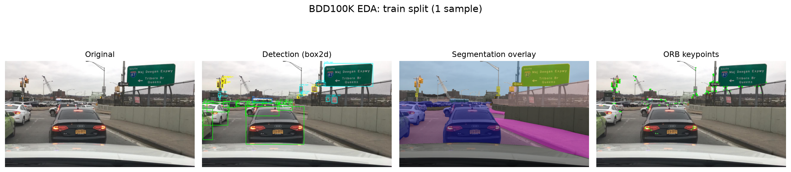
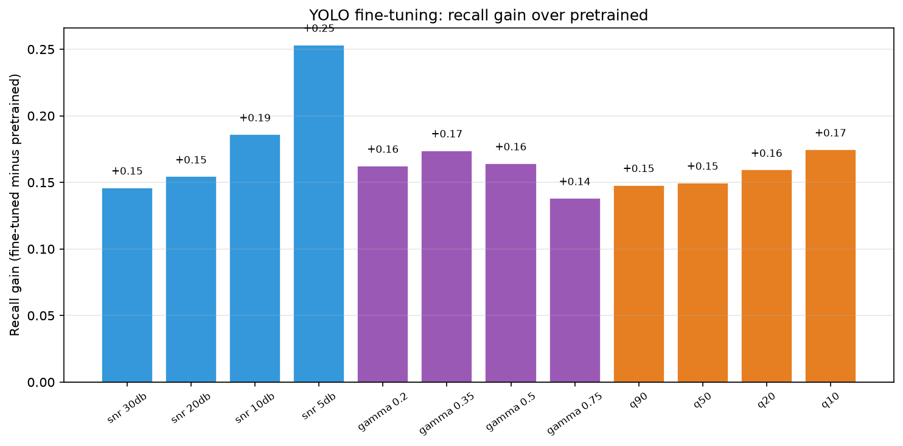
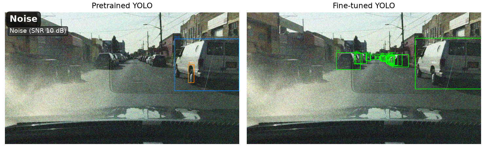
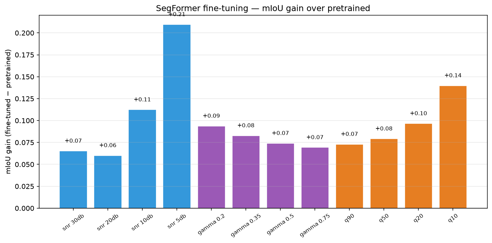
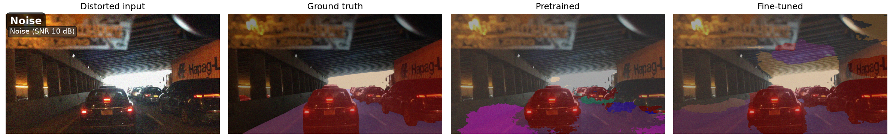

<!--
Build this deck directly with Marp (run from the repo root so image paths resolve):
  marp PRESENTATION.md --pptx      # PowerPoint
  marp PRESENTATION.md --pdf       # PDF
  marp PRESENTATION.md -w          # live preview
Images live in outputs/figures/ and are referenced with repo-relative paths.
-->

<!-- _class: lead -->

# Robustness of Vision Algorithms Under Image Degradations

Digital Image Processing Course Project

Nadav Moshe · Alon Ron · 2025-2026

---

## The Research Question

> When dashcam images degrade, do **classical fixes** help, or do we need to **retrain the model**?

- We degrade clean driving images with three synthetic **distortions**: Gaussian noise, low light, and JPEG compression.
- We test two recovery strategies: **blind classical enhancement** (NLM / CLAHE / bilateral) vs **fine-tuning** the model on distorted data.
- We measure impact on three tasks spanning low-level to high-level vision: **ORB** feature matching, **YOLOv8n** detection, **SegFormer-b0** segmentation.
- Core tension: an image that *looks* cleaner is not necessarily a *better input* for a model.

---

## Dataset: BDD100K

- Berkeley DeepDrive dashcam benchmark: diverse weather, lighting, and traffic.
- Robustness set: **100 images** (fixed seed 42) with **both** detection boxes and segmentation masks, so YOLO and SegFormer share an identical sample.
- Each image: RGB frame (1280×720), bounding boxes, and 19-class semantic masks.

Original · detection GT · segmentation overlay · ORB keypoints

---

## Three Distortions, Four Levels Each

- **Gaussian noise**: target SNR (dB); levels 30 · 20 · 10 · 5 (mild to severe).
- **Low light**: gamma curve; levels γ = 0.75 · 0.5 · 0.35 · 0.2 (progressively darker).
- **JPEG compression**: quality factor *Q*; levels 90 · 50 · 20 · 10 (stronger blocking).

---

## Intensity Sweep: Clean to Severe

Rows: Gaussian noise · low light · JPEG. Columns: clean to strongest level.

---

## Distorted vs Enhanced

- Each distortion gets one matched classical enhancement: noise → **NLM**, low light → **CLAHE**, JPEG → **upscale + bilateral**.
- Shown at the strongest level: noise SNR 5 dB, low light γ = 0.2, JPEG *Q* = 10.
- Enhancement is **blind**: no access to the clean reference at inference.

---

## Distorted → Enhanced (strongest level)

Columns: original · distorted · enhanced. Rows: noise · low light · JPEG.

---

## Clean Baselines

Reference performance on the 100 undistorted images, before any degradation.

| Task | Metric | Clean score |
|------|--------|-------------|
| ORB matching | Match ratio | **1.000** |
| YOLOv8n | Recall @ IoU 0.5 | **0.319** (precision 0.725, matched IoU 0.813) |
| SegFormer-b0 | Mean IoU | **0.469** |

*Trends on a 100-image subset, not official BDD100K leaderboard scores.*

---

## ORB: Fragile in Low Light

- Matching degrades smoothly with noise and JPEG, but **collapses in darkness**.
- Worst case γ = 0.2: matching ratio drops to **0.097** (from 1.000 clean).
- **CLAHE helps** low light: recovery **+0.089** at γ = 0.35, +0.056 at γ = 0.5.
- **NLM hurts** mild noise (-0.098 at SNR 30 dB) by smoothing texture ORB relies on.

---

## YOLO: Collapses Under Noise

- Frozen YOLOv8n recall falls from **0.319** clean to **0.077** at SNR 5 dB.
- Mild JPEG (*Q* = 10 → 0.225) and low light (γ = 0.2 → 0.131) are tolerated far better than severe noise.
- **Enhancement barely helps**: NLM recovers only +0.002 at SNR 5 dB.

---

## SegFormer: Noise Blurs Boundaries

- Frozen SegFormer-b0 mIoU falls from **0.469** clean to **0.257** at SNR 5 dB.
- Noise is the most damaging distortion: thin structures and class boundaries break down.
- **NLM even hurts** mild noise (SNR 30 dB: 0.470 → 0.389, gain -0.081).

---

## Key Insight

> A cleaner-looking image is **not** a better input for the model.

- **NLM** smooths texture and boundaries → hurts ORB descriptors and SegFormer.
- **CLAHE** lifts contrast for ORB matching, but does not help frozen deep models.
- **Bilateral** softens JPEG blocks visually but cannot restore discarded frequency content.
- Restoration quality and task-performance recovery must be measured **separately**.

---

## Fine-Tuning Fixes It

- Adapt the models by retraining on distorted data (500 train / 100 val per level, 30 epochs).
- Evaluated apples-to-apples on the **same 100-image robustness set** as the frozen models.

| Task | Worst level | Frozen distorted | **Fine-tuned** |
|------|-------------|-----------------:|---------------:|
| YOLO recall | Noise SNR 5 dB | 0.077 | **0.405** |
| SegFormer mIoU | Noise SNR 5 dB | 0.257 | **0.561** |
| SegFormer mIoU | JPEG *Q* = 10 | 0.370 | **0.622** |

---

## Fine-Tuning: YOLO

- Fine-tuning improves recall at **every** distortion level (bars show fine-tuned minus pretrained).
- Largest gains hit the hardest cases: **+0.25** at SNR 5 dB, **+0.17** at JPEG *Q* = 10, **+0.17** at γ = 0.35.

---

## Fine-Tuning in Action: YOLO

Noise SNR 10 dB: fine-tuned YOLO recovers the cars and van the pretrained model misses.

Left: pretrained · right: fine-tuned (green = detections).

---

## Fine-Tuning: SegFormer

- Fine-tuning improves mIoU at **every** level (bars show fine-tuned minus pretrained).
- Largest gains under severe degradation: **+0.21** at SNR 5 dB, **+0.14** at JPEG *Q* = 10, **+0.11** at SNR 10 dB.

---

## Fine-Tuning in Action: SegFormer

Noise SNR 10 dB: fine-tuned SegFormer restores road, cars, and boundaries that the pretrained model loses.

Columns: distorted input · ground truth · pretrained · fine-tuned.

---

## What Works When

| Distortion | Best fix | Why |
|------------|----------|-----|
| Gaussian noise | **Fine-tuning** | NLM smooths boundaries; adaptation learns the noise distribution |
| Low light | **CLAHE** (ORB) · **fine-tuning** (deep) | CLAHE lifts contrast for matching; deep models need adaptation |
| JPEG | **Fine-tuning** | Bilateral cannot restore lost frequencies; adaptation handles block artifacts |

---

## Conclusions

1. Frozen models fail under heavy noise; classical enhancement barely helps and sometimes hurts.
2. ORB gains from CLAHE in low light, but NLM/bilateral degrade its binary descriptors.
3. **Fine-tuning is the reliable fix** for YOLO and SegFormer across all three distortions.
4. Low-level and high-level robustness diverge: what looks cleaner is not what the model needs.

---

<!-- _class: lead -->

## Thank You

[github.com/NadavMoshe1/Image-Processing](https://github.com/NadavMoshe1/Image-Processing)

Nadav Moshe · Alon Ron
