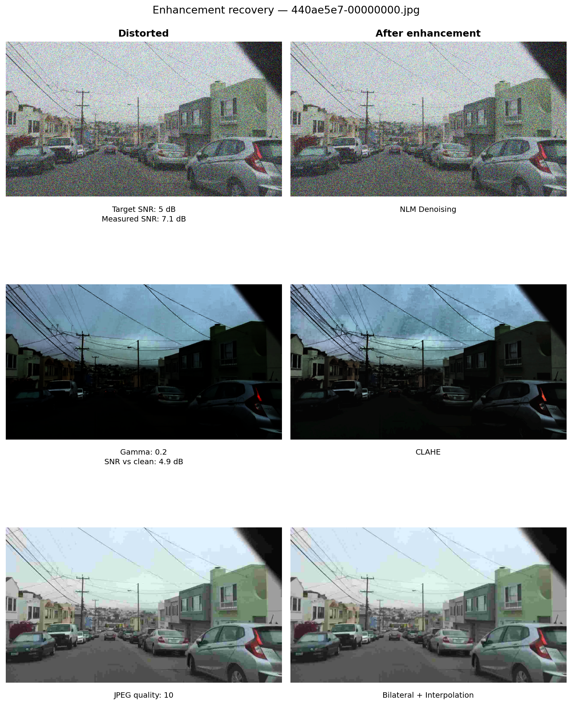
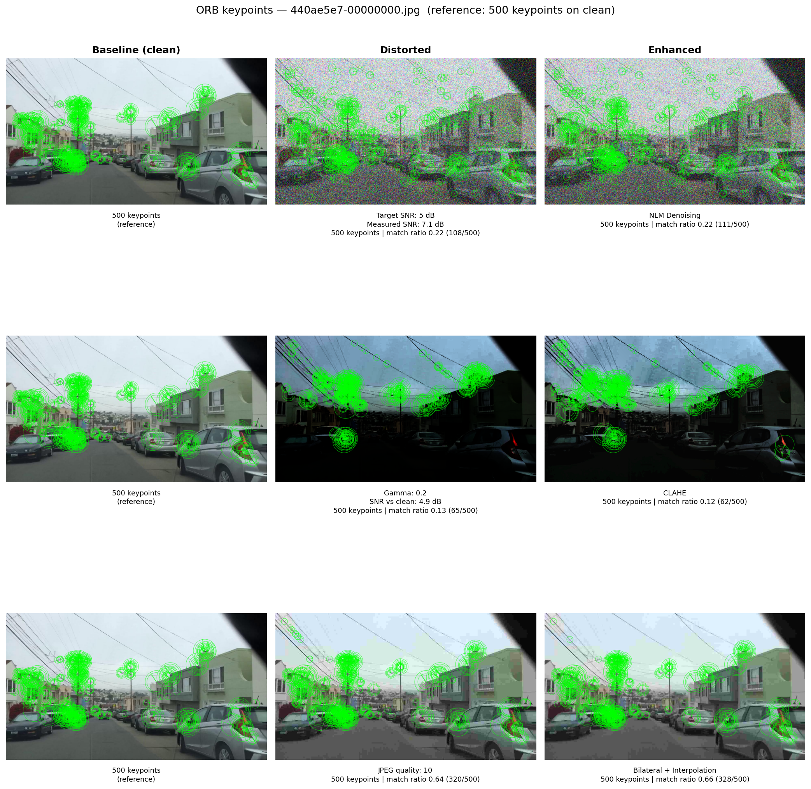

# Robustness of Vision Algorithms Under Image Degradations

**Course project — Digital Image Processing / Computer Vision**

## Abstract

We study how common image degradations affect vision pipelines at two levels of abstraction: **low-level feature matching** (ORB keypoints) and **high-level scene understanding** (object detection with YOLOv8, semantic segmentation with SegFormer). Using the BDD100K driving dataset, we simulate three distortion types—Gaussian noise, low-light exposure, and JPEG compression—at multiple intensities. For each condition we measure performance degradation and assess whether **classical pre-processing** (NLM denoising, CLAHE, bilateral deblocking) can recover it. A complementary **fine-tuning** stage trains YOLOv8 on distorted data to test whether model adaptation outperforms blind enhancement.

---

## 1. Introduction

Autonomous driving systems rely on visual perception under imperfect imaging conditions: sensor noise, poor lighting, and lossy compression all corrupt the input before it reaches downstream modules. Understanding which algorithms are robust—and whether simple restoration helps—is central to building reliable pipelines.

This project follows a controlled experimental design: start from clean ground-truth imagery, apply parametric distortions, then compare three recovery strategies:

1. **None** — evaluate the off-the-shelf model or feature extractor directly on degraded input  
2. **Pre-processing enhancement** — apply a distortion-specific classical restoration step  
3. **Fine-tuning** — adapt a deep model to the distortion domain (detection only)

---

## 2. Dataset

We use [BDD100K](https://www.bdd100k.com/) (Berkeley DeepDrive), a large-scale benchmark of dashcam scenes with diverse weather, lighting, and traffic. From the 10k-image release we use:

- **RGB frames** (1280×720) from the train split  
- **Object-detection annotations** — axis-aligned bounding boxes with category labels (car, person, truck, traffic light, etc.)  
- **Semantic-segmentation masks** — per-pixel class labels over 19 Cityscapes-compatible categories (road, sidewalk, building, sky, vehicle, …)

Approximately **3,430 train images** contain both detection boxes and segmentation masks; these form the pool for high-level evaluation. ORB matching uses any train frame and does not require annotations.

### Experimental sample

| Task | Method | *N* | Annotation requirement |
|------|--------|-----|------------------------|
| Feature matching | ORB | 100 | None |
| Object detection | YOLOv8n | 100 | Bounding boxes + seg mask |
| Semantic segmentation | SegFormer-b0 | 100 | Seg mask + bounding boxes |

Images are sampled with a fixed random seed for reproducibility. Each image is evaluated under **three distortion types × four intensity levels** (12 degraded conditions), plus the paired enhancement for each type.

### Data preview

*Example train images with detection boxes, semantic labels, and detected ORB keypoints (green).*

---

## 3. Degradation Model

All distortions are applied **synthetically** to clean images, producing a controlled (clean, degraded) pair for every frame. Each distortion type is swept over **four intensity levels**; the strongest setting is shown in the enhancement figures below.

*Each row: original scene, strongest distortion, and paired restoration. Noise at SNR 5 dB, low light at γ = 0.2, JPEG at quality 10.*

### 3.1 Gaussian noise

Independent Gaussian noise is added to every pixel channel until a target **signal-to-noise ratio (SNR)** is reached:

\[
\mathrm{SNR} = 10 \log_{10} \frac{P_{\mathrm{signal}}}{P_{\mathrm{noise}}}
\]

where \(P_{\mathrm{signal}}\) is the mean squared intensity of the clean image and \(P_{\mathrm{noise}}\) is the variance of the added noise. **Levels:** 30, 20, 10, 5 dB — lower SNR means more noise.

**Visual effect:** fine grain across the image; edges and textures become harder to distinguish. At SNR 5 dB the scene is visibly speckled, mimicking high-ISO sensor noise or poor wireless transmission.

**Paired restoration:** Non-Local Means (NLM) denoising — see §4.1.

### 3.2 Low light (gamma correction)

Brightness is reduced with a power-law **gamma** mapping on normalized intensities:

\[
I_{\mathrm{out}} = 255 \cdot \left(\frac{I_{\mathrm{in}}}{255}\right)^{1/\gamma}, \quad \gamma \in (0, 1]
\]

**Levels:** γ = 0.75, 0.5, 0.35, 0.2 — smaller γ yields darker images (exponent \(1/\gamma > 1\) compresses highlights toward black).

**Visual effect:** global under-exposure; shadow regions lose discriminability and color saturation drops. At γ = 0.2 most detail sits in the bottom of the dynamic range, as in night driving or a severely under-exposed dashcam frame.

**Paired restoration:** CLAHE on the luminance channel — see §4.2.

### 3.3 JPEG compression

Images are lossy-compressed with the standard JPEG pipeline at quality factor *Q* ∈ [1, 100], then decoded back to RGB.

**Levels:** *Q* = 90, 50, 20, 10 — lower *Q* means stronger compression.

**Visual effect:** **blocking** along 8×8 DCT block boundaries, **ringing** (Gibbs artifacts) near sharp edges, and loss of fine texture inside blocks. At *Q* = 10 the grid pattern is clearly visible on roads and sky — typical of aggressive bandwidth limits in telematics or cloud upload.

**Paired restoration:** upscale + bilateral filter — see §4.3.

### Intensity sweep

The same scene at all four levels per distortion (left column = clean reference):

---

## 4. Restoration Methods

Each distortion is paired with one **classical, blind** enhancement: the restorer does not know the distortion parameters used at synthesis time. The goal is to approximate what a pre-processing stage could do before feeding images to a vision model.

### 4.1 Non-Local Means (NLM) — for noise

NLM replaces each pixel by a weighted average of pixels in a search window whose **patches** look similar — not just pixels that are spatially close. Similar structures across the image reinforce each other while random noise averages out.

**Why it helps:** exploits self-similarity in natural scenes (road texture, building facades) to suppress uncorrelated noise.

**Trade-off:** smoothing can blur fine detail and shift local contrast, which hurts **ORB binary descriptors** that rely on exact intensity comparisons.

### 4.2 CLAHE — for low light

**Contrast Limited Adaptive Histogram Equalization** operates on small tiles independently. Each tile's histogram is equalized to spread intensity across the dynamic range, but a **clip limit** caps how much any histogram bin can grow — preventing noise from being amplified into salt-and-pepper artifacts.

We apply CLAHE to the **L channel in LAB color space**, leaving chrominance (a, b) unchanged so colors stay more natural than per-channel RGB equalization.

**Why it helps:** lifts shadow detail and local contrast in dark regions without a global wash-out of already-bright areas (e.g. sky, headlights).

**Trade-off:** can over-boost noise in very dark patches; mild γ (0.75) may look worse after CLAHE because the image was not severely dark to begin with.

### 4.3 Upscale + bilateral filter — for JPEG

A three-step **deblocking** heuristic:

1. **2× cubic upsampling** — spreads 8×8 block edges into smoother ramps  
2. **Bilateral filtering** — averages within a spatial window only where neighboring pixels have **similar color**, smoothing block seams in flat regions while preserving true object edges  
3. **Downscale** to original resolution — aggregates pixels and removes upsampling artifacts  

**Why it helps:** targets the high-frequency blocking pattern JPEG introduces, especially in skies and road surfaces.

**Trade-off:** cannot recover frequency content truly discarded by compression; edges may soften slightly.

| Distortion | Enhancement | Core idea |
|------------|-------------|-----------|
| Gaussian noise | NLM | Patch self-similarity averaging |
| Low light | CLAHE | Local contrast lift with noise clip |
| JPEG | Upscale + bilateral | Soften block edges, preserve boundaries |

---

## 5. Vision Tasks and Models

### 5.1 ORB feature matching (low-level)

**ORB** (Oriented FAST and Rotated BRIEF) detects up to 500 corner-like keypoints per image and assigns a 256-bit binary descriptor to each. We treat the **clean image as reference** and the distorted or enhanced image as **query**. Descriptors are matched with brute-force Hamming distance; matches are accepted only if they pass **Lowe's ratio test** (best distance &lt; 0.75 × second-best distance).

This probes whether local appearance—corners, edges, texture—is preserved across degradation, which underpins SLAM, tracking, and correspondence-based methods.

### 5.2 Object detection (high-level)

**YOLOv8n** (nano variant, COCO-pretrained) predicts axis-aligned boxes for traffic object classes. Predictions are matched to BDD100K ground-truth boxes by category and spatial overlap. We report performance on degraded and enhanced inputs using the same frozen weights.

### 5.3 Semantic segmentation (high-level)

**SegFormer-b0** (Cityscapes-finetuned) assigns one of 19 semantic classes to each pixel. Predictions are compared to BDD100K index masks. Class definitions align with Cityscapes trainIds, enabling direct use of a pretrained model.

### 5.4 Fine-tuning (detection)

As a fourth recovery strategy, YOLOv8 is fine-tuned on a larger set of **distorted** train images (with clean labels) and evaluated on held-out distorted validation frames. This tests **domain adaptation** against blind pre-processing.

---

## 6. Evaluation Metrics

### 6.1 ORB matching ratio

\[
\text{matching ratio} = \frac{\#\ \text{good descriptor matches}}{\#\ \text{keypoints on clean image}}
\]

A ratio of 1.0 means every reference keypoint found a unique, confident match on the query. **Recovery** = matching ratioenhanced − matching ratiodistorted.

### 6.2 Detection — recall @ IoU 0.5

For each ground-truth box, we find the highest-IoU prediction of the **same class**. A match is counted if **IoU ≥ 0.5**, where:

\[
\mathrm{IoU} = \frac{\text{area of overlap}}{\text{area of union}}
\]

**Recall** = matched ground-truth boxes / total ground-truth boxes. We also report **precision** (matched predictions / total predictions) and **mean matched IoU** among accepted pairs.

### 6.3 Segmentation — mean IoU (mIoU)

For each semantic class *c*, pixel-level IoU is computed between prediction and ground truth. **mIoU** is the mean over classes present in the image. Pixels labeled *ignore* (trainId 255) are excluded.

---

## 7. Experimental Protocol

For every task and distortion type:

1. **Baseline** — evaluate on clean images (upper bound)  
2. **Distorted** — evaluate on synthetically degraded images  
3. **Enhanced** — evaluate on degraded images after the paired restoration step  
4. **Fine-tuned** *(detection only)* — evaluate a model trained on distorted data  

Metrics are averaged over the evaluation set and plotted as a function of distortion intensity. Results are reported per class where applicable.

---

## 8. Results

### 8.1 ORB matching (*N* = 100)

| Distortion | Level | Distorted | Enhanced | Recovery |
|------------|-------|-----------|----------|----------|
| Noise | SNR 30 dB | 0.943 | 0.846 | −0.098 |
| Noise | SNR 20 dB | 0.859 | 0.806 | −0.053 |
| Noise | SNR 10 dB | 0.612 | 0.610 | −0.002 |
| Noise | SNR 5 dB | 0.402 | 0.404 | +0.002 |
| Low light | γ = 0.75 | 0.819 | 0.532 | −0.287 |
| Low light | γ = 0.5 | 0.518 | 0.574 | +0.056 |
| Low light | γ = 0.35 | 0.301 | 0.391 | +0.089 |
| Low light | γ = 0.2 | 0.097 | 0.126 | +0.028 |
| JPEG | *Q* = 90 | 0.962 | 0.888 | −0.073 |
| JPEG | *Q* = 50 | 0.896 | 0.869 | −0.027 |
| JPEG | *Q* = 20 | 0.816 | 0.805 | −0.011 |
| JPEG | *Q* = 10 | 0.691 | 0.694 | +0.002 |

*Clean baseline matching ratio: **1.000***

**Findings.** Noise and JPEG reduce matching monotonically with severity. **CLAHE improves low-light matching** at moderate-to-strong darkening (γ = 0.35–0.5). NLM and bilateral smoothing often **hurt** ORB matching: smoothing alters the binary descriptors even when the image looks visually cleaner.

*Green circles = detected keypoints (size = scale, radial line = orientation). Enhancement can change keypoint locations and counts.*

### 8.2 Object detection (*N* = 100)

**Clean baseline**

| Metric | Value |
|--------|-------|
| Recall @ IoU 0.5 | 0.319 |
| Precision | 0.725 |
| Mean matched IoU | 0.813 |

*Recall varies widely by class — cars and buses are detected most reliably; traffic signs and two-wheelers are hardest on this sample.*

**Findings.** Heavy noise (SNR 5 dB) causes the largest recall drop. Pre-processing provides **limited recovery** for detection; YOLO's frozen representations are relatively insensitive to mild JPEG and low-light shifts but collapse under strong noise. Fine-tuning on distorted data is intended to address this gap.

### 8.3 Semantic segmentation (*N* = 100)

**Clean baseline — mIoU = 0.469**

*Large static regions (road, sky, vegetation) segment best (IoU ≥ 0.67); thin or rare classes (poles, traffic signs, bus, truck) are weakest.*

| Distortion | Level | Distorted | Enhanced | Recovery |
|------------|-------|-----------|----------|----------|
| Noise | SNR 30 dB | 0.470 | 0.389 | −0.081 |
| Noise | SNR 20 dB | 0.461 | 0.392 | −0.069 |
| Noise | SNR 10 dB | 0.390 | 0.398 | +0.008 |
| Noise | SNR 5 dB | 0.257 | 0.266 | +0.009 |
| Low light | γ = 0.75 | 0.467 | 0.444 | −0.023 |
| Low light | γ = 0.5 | 0.458 | 0.430 | −0.028 |
| Low light | γ = 0.35 | 0.434 | 0.411 | −0.024 |
| Low light | γ = 0.2 | 0.353 | 0.348 | −0.005 |
| JPEG | *Q* = 90 | 0.469 | 0.458 | −0.011 |
| JPEG | *Q* = 50 | 0.459 | 0.446 | −0.014 |
| JPEG | *Q* = 20 | 0.434 | 0.429 | −0.005 |
| JPEG | *Q* = 10 | 0.370 | 0.367 | −0.002 |

**Findings.** On 100 images, SegFormer is **most sensitive to noise**: mIoU drops from 0.469 (clean) to **0.257** at SNR 5 dB. Low light and JPEG degrade gradually (mIoU ≈ 0.35 at γ = 0.2; ≈ 0.37 at *Q* = 10). **NLM denoising hurts mild-noise segmentation** (recovery −0.07 to −0.08 at SNR 20–30 dB) by blurring class boundaries; CLAHE and bilateral filtering provide **no meaningful recovery** and can slightly reduce mIoU. Road and sky remain the most robust classes under distortion.

---

## 9. Discussion

A consistent theme across tasks is that **low-level and high-level robustness diverge**, and **blind enhancement is not universally beneficial**. CLAHE restores ORB correspondences in dark scenes but does not improve YOLO recall or SegFormer mIoU. NLM denoising degrades ORB matching and **actively hurts segmentation at mild noise levels** by smoothing pixel boundaries that define class regions. Deep models pretrained on clean natural images tolerate mild JPEG and exposure shifts but fail abruptly under heavy noise (YOLO recall and SegFormer mIoU both collapse at SNR 5 dB)—suggesting that **domain adaptation (fine-tuning)** may be necessary where classical restoration is insufficient or harmful.

All three tasks were evaluated on **100 train images** (*seed* = 42) for comparable sample sizes.

---

## 10. Reproducibility

Source code implements the pipeline described above (distortion synthesis, enhancement, evaluation, and plotting). Dependencies are listed in `requirements.txt`. Raw BDD100K data must be obtained separately from the [official website](https://www.bdd100k.com/); it is not redistributed with this repository.
