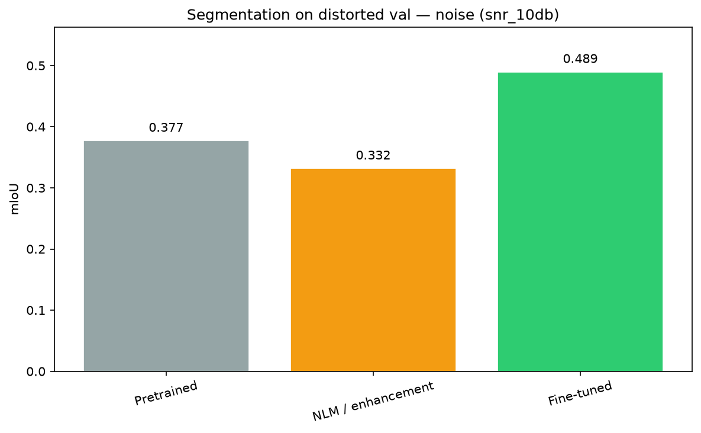
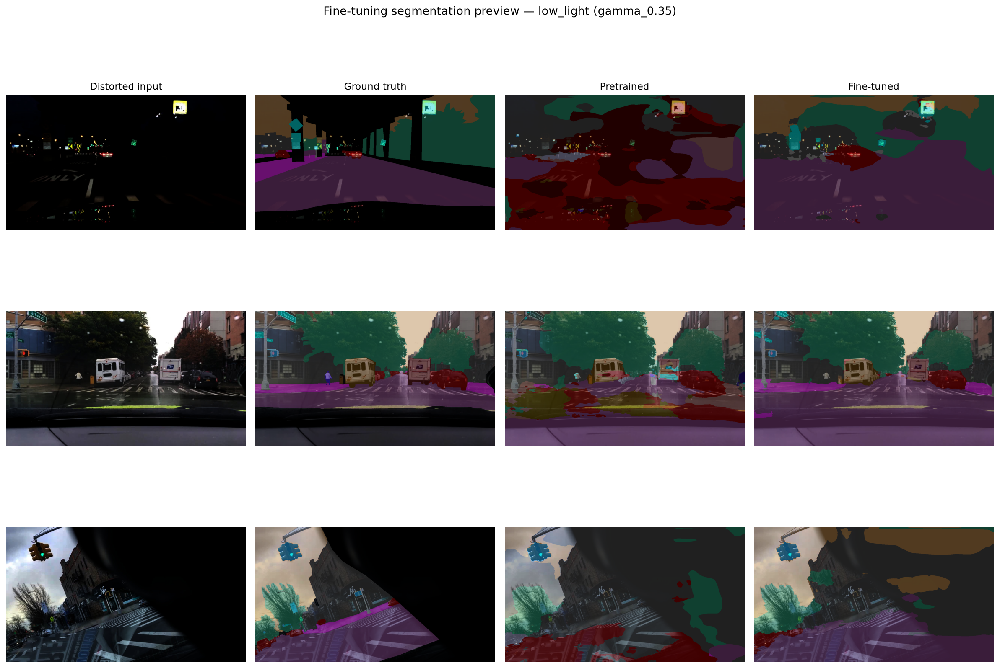

# Robustness of Vision Algorithms Under Image Degradations

**Digital Image Processing - Course Project**  
**Semester:** [2025-2026]  
**Authors:** [Nadav Moshe, Alon Ron]

---

## Key Takeaways

**Research question:** When dashcam images degrade (noise, low light, JPEG compression), do classical pre-processing fixes help - or do we need to adapt the model?

- **Distortions:** Three synthetic types on BDD100K driving scenes, each at four intensity levels - Gaussian noise (SNR), low light (γ), JPEG compression (*Q*).
- **Restoration strategies:** (1) none, (2) blind classical enhancement (NLM / CLAHE / bilateral deblocking), (3) **Fine-Tuning** YOLOv8n and SegFormer-b0 on distorted data.
- **Tasks:** ORB matching ratio (low-level), YOLOv8n detection, SegFormer-b0 segmentation (high-level).
- **Main findings:** Classical enhancement helps ORB in some low-light cases but rarely helps - and sometimes hurts - frozen deep models. **Fine-Tuning** recovers much of the performance lost to distortion on held-out val images (e.g. YOLO at SNR 10 dB: 0.24 recall pretrained vs **0.42** Fine-Tuned; SegFormer at SNR 5 dB: 0.22 mIoU with CLAHE/NLM vs **0.45** Fine-Tuned). Low-level and high-level robustness diverge: what looks cleaner after denoising is not always what downstream models need.

---

## Motivation

Autonomous driving systems rely on visual perception under imperfect imaging conditions: sensor noise, poor light, and lossy compression all corrupt the input before it reaches downstream modules. Understanding which algorithms are robust - and whether simple restoration helps - is central to building reliable pipelines.

This project follows a controlled experimental design: start from clean ground-truth imagery, apply parametric distortions, then compare three recovery strategies:

1. **None** - evaluate the off-the-shelf model or feature extractor directly on degraded input  
2. **Pre-processing enhancement** - apply a distortion-specific classical restoration step  
3. **Fine-Tuning** - adapt YOLOv8n (detection) and SegFormer-b0 (segmentation) on distorted training images

---

## Data & Setup

We use [BDD100K](https://www.bdd100k.com/) (Berkeley DeepDrive), a large-scale benchmark of dashcam scenes with diverse weather, lighting, and traffic. All experiments draw from the official BDD100K **train split** only:

- **RGB frames** (1280×720)  
- **Object-detection annotations** - axis-aligned bounding boxes with category labels (car, person, truck, traffic light, etc.)  
- **Semantic-segmentation masks** - per-pixel class labels over 19 Cityscapes-compatible categories (road, sidewalk, building, sky, vehicle, …)

Approximately **3,430 train images** contain both detection boxes and segmentation masks.

### Train vs evaluation splits

| Role | Images | Source | Used for |
|------|--------|--------|----------|
| **Robustness evaluation set** | 100 | Train split; random sample with detection + seg labels | Frozen-model baseline, distorted, and enhanced runs (ORB, YOLO, SegFormer) |
| **Fine-Tuning train set** | 500 per distortion | Train split; detection labels only; **disjoint from FT val** | YOLO / SegFormer Fine-Tuning |
| **Fine-Tuning val set** | 100 per distortion | Train split; detection labels only; **disjoint from FT train** | Fine-Tuned model evaluation only |

The robustness evaluation set and Fine-Tuning sets are **separate samples** from the train split. Frozen pretrained models are never Fine-Tuned on the 100-image robustness set. Fine-Tuned models are scored on their own held-out val images (100 per distortion), not on the robustness benchmark images. We use the train split throughout because it provides the labeled pool required for detection and segmentation; the official val split lacks segmentation masks in the same release layout.

### Why *N* = 100 for robustness evaluation?

One hundred images is a deliberate course-project trade-off: each frame is evaluated under **12 distortion levels × up to 3 input conditions** (clean reference, distorted, enhanced), so a single task already requires thousands of model runs. A fixed 100-image sample keeps runtime manageable on a single GPU while still spanning diverse scenes. The same 100 images are shared across detection and segmentation so high-level results are directly comparable. Trends (noise collapse, CLAHE helping ORB but not YOLO) are consistent across the sweep; absolute numbers are estimates on this subset, not full-dataset benchmarks.

### Experimental sample

| Task | Method | *N* | Annotation requirement |
|------|--------|-----|------------------------|
| Feature matching | ORB | 100 | None |
| Object detection | YOLOv8n (YOLOv8 nano) | 100 | Bounding boxes |
| Semantic segmentation | SegFormer-b0 | 100 | Segmentation masks |

*Detection needs bounding boxes; segmentation needs pixel masks. We restrict high-level evaluation to images that have both annotation types so detection and segmentation share an identical sample.*

Each image is evaluated under **three distortion types × four intensity levels** (12 degraded conditions), plus the paired enhancement for each type.

### Performance vs intensity (assignment mapping)

The assignment asks for performance **per SNR**. We apply the same idea to all three distortions:

| Distortion | Intensity parameter | Levels reported |
|------------|---------------------|---------------|
| Gaussian noise | SNR (dB) | 30, 20, 10, 5 |
| Low light | γ (gamma) | 0.75, 0.5, 0.35, 0.2 |
| JPEG | *Q* (quality) | 90, 50, 20, 10 |

Metrics are plotted and tabulated as a function of these intensity parameters for every distortion type.

### Data preview

*Example train images with detection boxes, semantic labels, and detected ORB keypoints (green).*

---

## Distortions & Restorations

All distortions are applied **synthetically** to clean images, producing a controlled (clean, degraded) pair for every frame. Each distortion type is swept over **four intensity levels**.

Each distortion is paired with one **classical, blind** restoration: the restorer does not know the distortion parameters used at synthesis time. The goal is to approximate what a pre-processing stage could do before feeding images to a vision model.

| Distortion | Enhancement | Core idea |
|------------|-------------|-----------|
| Gaussian noise | NLM | Patch self-similarity averaging |
| Low light | CLAHE | Local contrast lift with noise clip |
| JPEG | Upscale + bilateral | Soften block edges, preserve boundaries |

### Gaussian noise

Independent Gaussian noise is added to every pixel channel until a target **signal-to-noise ratio (SNR)** is reached:

$$\mathrm{SNR\ (dB)} = 10 \log_{10}\!\left(\frac{P_{\mathrm{signal}}}{P_{\mathrm{noise}}}\right)$$

where $P_{\mathrm{signal}}$ is the mean squared intensity of the clean image and $P_{\mathrm{noise}}$ is the variance of the added noise.

**Levels:** 30, 20, 10, 5 dB - lower SNR means more noise.

**Visual effect:** fine grain across the image; edges and textures become harder to distinguish. At SNR 5 dB the scene is visibly speckled, mimicking high-ISO sensor noise or poor wireless transmission.

**Paired restoration:** Non-Local Means (NLM) denoising.

### Low light (gamma correction)

Brightness is reduced with a power-law **gamma** mapping on normalized intensities:

$$I_{\mathrm{out}} = 255 \cdot \left(\frac{I_{\mathrm{in}}}{255}\right)^{1/\gamma}, \quad \gamma \in (0, 1]$$

**Levels:** γ = 0.75, 0.5, 0.35, 0.2 - smaller γ yields darker images (exponent $1/\gamma > 1$ compresses highlights toward black).

**Visual effect:** global under-exposure; shadow regions lose discriminability and color saturation drops. At γ = 0.2 most detail sits in the bottom of the dynamic range, as in night driving or a severely under-exposed dashcam frame.

**Paired restoration:** CLAHE on the luminance channel.

### JPEG compression

Images are lossy-compressed with the standard JPEG pipeline at quality factor $Q \in [1, 100]$, then decoded back to RGB.

**Levels:** *Q* = 90, 50, 20, 10 - lower *Q* means stronger compression.

**Visual effect:** **blocking** along 8×8 DCT block boundaries, **ringing** (Gibbs artifacts) near sharp edges, and loss of fine texture inside blocks. At *Q* = 10 the grid pattern is clearly visible on roads and sky - typical of aggressive bandwidth limits in telematics or cloud upload.

**Paired restoration:** upscale + bilateral filter.

### Intensity sweep

The same scene at all four levels per distortion type. **Layout:** 3 rows (Gaussian Noise, Low Light, JPEG Compression) × 5 columns (Clean + four intensity levels). Distortion type on the left; each row has column titles (Clean, SNR / γ / *Q* values).

### Preview: clean, distorted, and restored

One dashcam frame per distortion type at the **strongest** level, with paired restoration. **Layout:** 3 rows × 3 columns (Original | Distorted | Enhanced) = **9 panels**.

*Noise at SNR 5 dB, low light at γ = 0.2, JPEG at quality 10. The Enhanced column uses NLM, CLAHE, and upscale+bilateral respectively.*

### Restoration details

**Non-Local Means (NLM) - for noise**

NLM replaces each pixel by a weighted average of pixels in a search window whose **patches** look similar - not just pixels that are spatially close. Similar structures across the image reinforce each other while random noise averages out.

**Why it helps:** exploits self-similarity in natural scenes (road texture, building facades) to suppress uncorrelated noise.

**Trade-off:** smoothing can blur fine detail and shift local contrast, which hurts **ORB binary descriptors** that rely on exact intensity comparisons.

**CLAHE - for low light**

**Contrast Limited Adaptive Histogram Equalization** operates on small tiles independently. Each tile's histogram is equalized to spread intensity across the dynamic range, but a **clip limit** caps how much any histogram bin can grow - preventing noise from being amplified into salt-and-pepper artifacts.

We apply CLAHE to the **L channel in LAB color space**, leaving chrominance (a, b) unchanged so colors stay more natural than per-channel RGB equalization.

**Why it helps:** lifts shadow detail and local contrast in dark regions without a global wash-out of already-bright areas (e.g. sky, headlights).

**Trade-off:** can over-boost noise in very dark patches; mild γ (0.75) may look worse after CLAHE because the image was not severely dark to begin with.

**Upscale + bilateral filter - for JPEG**

A three-step **deblocking** heuristic:

1. **2× cubic upsampling** - spreads 8×8 block edges into smoother ramps  
2. **Bilateral filtering** - averages within a spatial window only where neighboring pixels have **similar color**, smoothing block seams in flat regions while preserving true object edges  
3. **Downscale** to original resolution - aggregates pixels and removes upsampling artifacts  

**Why it helps:** targets the high-frequency blocking pattern JPEG introduces, especially in skies and road surfaces.

**Trade-off:** cannot recover frequency content truly discarded by compression; edges may soften slightly.

---

## What We Measured

### Vision tasks and models

**ORB feature matching (low-level)**

**ORB** (Oriented FAST and Rotated BRIEF) detects up to 500 corner-like keypoints per image and assigns a 256-bit binary descriptor to each. We treat the **clean image as reference** and the distorted or enhanced image as **query**. Descriptors are matched with brute-force Hamming distance; matches are accepted only if they pass **Lowe's ratio test** (best distance &lt; 0.75 × second-best distance).

This probes whether local appearance - corners, edges, texture - is preserved across degradation, which underpins SLAM, tracking, and correspondence-based methods. There is **no external ground truth** for ORB; we measure **descriptor correspondence against the clean reference frame**, not detection-style accuracy against labeled objects.

**Object detection (high-level)**

**YOLOv8n** (YOLOv8 nano, COCO-pretrained) predicts axis-aligned boxes for traffic object classes. Predictions are matched to BDD100K ground-truth boxes by category and spatial overlap. We report performance on degraded and enhanced inputs using the same frozen weights.

**Semantic segmentation (high-level)**

**SegFormer-b0** (Cityscapes-finetuned) assigns one of 19 semantic classes to each pixel. Predictions are compared to BDD100K index masks. Class definitions align with Cityscapes trainIds, enabling direct use of a pretrained model.

### Evaluation metrics

**ORB matching ratio**

$$\text{matching ratio} = \frac{\#\ \text{good descriptor matches}}{\#\ \text{keypoints on clean image}}$$

A ratio of 1.0 means every reference keypoint found a unique, confident match on the query. **Recovery** = matching ratioenhanced − matching ratiodistorted.

This is **not** classification accuracy: it counts how well keypoints on the clean image match descriptors on the degraded or enhanced query, with no labeled object ground truth.

**Detection - recall @ IoU 0.5**

For each ground-truth box, we find the highest-IoU prediction of the **same class**. A match is counted if **IoU ≥ 0.5**, where:

$$\mathrm{IoU} = \frac{\text{area of overlap}}{\text{area of union}}$$

**Recall** = matched ground-truth boxes / total ground-truth boxes. We also report **precision** (matched predictions / total predictions) and **mean matched IoU** among accepted pairs.

**Segmentation - mean IoU (mIoU)**

For each image, we compute pixel-level IoU per semantic class (excluding pixels with trainId 255), then take the **mean over classes present in that image** to get a per-image mIoU. Reported **mIoU** is the **average of per-image mIoU values** across the evaluation set. Per-class charts average each class's IoU over images where that class appears.

This is a **per-image mean** approach, not a single global confusion matrix over all pixels. Global confusion-matrix mIoU is the more common benchmark protocol; we use per-image averaging here for consistency with our per-image detection recall.

### Experimental protocol

For every task and distortion type:

1. **Baseline** - evaluate on clean images (upper bound)  
2. **Distorted** - evaluate on synthetically degraded images  
3. **Enhanced** - evaluate on degraded images after the paired restoration step  

For frozen-model tasks (ORB, YOLO, SegFormer), steps 1-3 use the 100-image robustness set. **Fine-Tuning** results are reported separately at the end (500 train / 100 val per distortion level, 30 epochs).

---

## Results

### ORB matching ratio (*N* = 100)

| Distortion | Level | Distorted | Enhanced | Recovery |
|------------|-------|-----------|----------|----------|
| Noise | SNR 30 dB | 0.943 | 0.846 | −0.098 |
| Noise | SNR 20 dB | 0.859 | 0.806 | −0.053 |
| Noise | SNR 10 dB | 0.612 | 0.610 | −0.002 |
| Noise | SNR 5 dB | 0.402 | 0.404 | +0.002 |
| Low light | γ = 0.75 | 0.819 | 0.532 | −0.287 |
| Low light | γ = 0.5 | 0.518 | 0.574 | +0.056 |
| Low light | γ = 0.35 | 0.301 | 0.391 | +0.089 |
| Low light | γ = 0.2 | 0.097 | 0.126 | +0.028 |
| JPEG | *Q* = 90 | 0.962 | 0.888 | −0.073 |
| JPEG | *Q* = 50 | 0.896 | 0.869 | −0.027 |
| JPEG | *Q* = 20 | 0.816 | 0.805 | −0.011 |
| JPEG | *Q* = 10 | 0.691 | 0.694 | +0.002 |

*Clean baseline matching ratio: **1.000** - by definition, not a measure of "real-world" performance. ORB compares each image to the clean reference; when query and reference are the same clean frame, every keypoint matches itself, so the ratio is 1.0. This differs from YOLO and SegFormer baselines, which are scored against human-annotated ground truth.*

**Findings.** Noise and JPEG reduce matching monotonically with severity. **CLAHE improves low-light matching** at moderate-to-strong darkening (γ = 0.35-0.5). NLM and bilateral smoothing often **hurt** ORB matching: smoothing alters the binary descriptors even when the image looks visually cleaner.

*Green circles = detected keypoints (size = scale, radial line = orientation). Enhancement can change keypoint locations and counts.*

### Object detection (*N* = 100)

**Clean baseline**

| Metric | Value |
|--------|-------|
| Recall @ IoU 0.5 | 0.319 |
| Precision | 0.725 |
| Mean matched IoU | 0.813 |

*Recall varies widely by class - cars and buses are detected most reliably; traffic signs and two-wheelers are hardest on this sample.*

#### Gaussian noise

| Level | Distorted | Enhanced | Recovery |
|-------|-----------|----------|----------|
| SNR 30 dB | 0.318 | 0.293 | −0.024 |
| SNR 20 dB | 0.299 | 0.300 | +0.001 |
| SNR 10 dB | 0.207 | 0.211 | +0.004 |
| SNR 5 dB | 0.077 | 0.079 | +0.002 |

#### Low light

| Level | Distorted | Enhanced | Recovery |
|-------|-----------|----------|----------|
| γ = 0.75 | 0.316 | 0.317 | +0.001 |
| γ = 0.5 | 0.290 | 0.292 | +0.002 |
| γ = 0.35 | 0.228 | 0.251 | +0.023 |
| γ = 0.2 | 0.131 | 0.158 | +0.027 |

#### JPEG compression

| Level | Distorted | Enhanced | Recovery |
|-------|-----------|----------|----------|
| *Q* = 90 | 0.319 | 0.310 | −0.009 |
| *Q* = 50 | 0.317 | 0.307 | −0.010 |
| *Q* = 20 | 0.284 | 0.291 | +0.007 |
| *Q* = 10 | 0.225 | 0.247 | +0.022 |

**Findings (frozen YOLOv8n).** Heavy noise (SNR 5 dB) causes the largest recall drop. Pre-processing provides **limited recovery** for detection; YOLOv8n's frozen representations are relatively insensitive to mild JPEG and low-light shifts but collapse under strong noise.

### Semantic segmentation (*N* = 100)

**Clean baseline - mIoU = 0.469**

*Large static regions (road, sky, vegetation) segment best (IoU ≥ 0.67); thin or rare classes (poles, traffic signs, bus, truck) are weakest.*

| Distortion | Level | Distorted | Enhanced | Recovery |
|------------|-------|-----------|----------|----------|
| Noise | SNR 30 dB | 0.470 | 0.389 | −0.081 |
| Noise | SNR 20 dB | 0.461 | 0.392 | −0.069 |
| Noise | SNR 10 dB | 0.390 | 0.398 | +0.008 |
| Noise | SNR 5 dB | 0.257 | 0.266 | +0.009 |
| Low light | γ = 0.75 | 0.467 | 0.444 | −0.023 |
| Low light | γ = 0.5 | 0.458 | 0.430 | −0.028 |
| Low light | γ = 0.35 | 0.434 | 0.411 | −0.024 |
| Low light | γ = 0.2 | 0.353 | 0.348 | −0.005 |
| JPEG | *Q* = 90 | 0.469 | 0.458 | −0.011 |
| JPEG | *Q* = 50 | 0.459 | 0.446 | −0.014 |
| JPEG | *Q* = 20 | 0.434 | 0.429 | −0.005 |
| JPEG | *Q* = 10 | 0.370 | 0.367 | −0.002 |

**Findings.** SegFormer is **most sensitive to noise**: mIoU drops from 0.469 (clean) to **0.257** at SNR 5 dB. Low light and JPEG degrade gradually (mIoU ≈ 0.35 at γ = 0.2; ≈ 0.37 at *Q* = 10). **NLM denoising hurts mild-noise segmentation** (recovery −0.07 to −0.08 at SNR 20-30 dB) by blurring class boundaries; CLAHE and bilateral filtering provide **no meaningful recovery** and can slightly reduce mIoU. Road and sky remain the most robust classes under distortion.

### Fine-Tuning

As a fourth recovery strategy, deep models are **Fine-Tuned** on distorted train images (500 per distortion level, with clean labels) and evaluated on held-out distorted val images (100 per level). This tests **domain adaptation** against blind pre-processing.

#### YOLOv8n detection (FT val *N* = 100 per level)

Recall @ IoU 0.5 on distorted val images - pretrained vs enhanced vs Fine-Tuned:

| Distortion | Level | Pretrained | Enhanced | Fine-Tuned |
|------------|-------|------------|----------|------------|
| Noise | SNR 30 dB | 0.321 | 0.301 | **0.467** |
| Noise | SNR 20 dB | 0.310 | 0.303 | **0.465** |
| Noise | SNR 10 dB | 0.234 | 0.240 | **0.420** |
| Noise | SNR 5 dB | 0.115 | 0.133 | **0.368** |
| Low light | γ = 0.75 | 0.315 | 0.318 | **0.453** |
| Low light | γ = 0.5 | 0.290 | 0.293 | **0.454** |
| Low light | γ = 0.35 | 0.248 | 0.268 | **0.422** |
| Low light | γ = 0.2 | 0.151 | 0.172 | **0.313** |
| JPEG | *Q* = 90 | 0.319 | 0.315 | **0.467** |
| JPEG | *Q* = 50 | 0.321 | 0.318 | **0.471** |
| JPEG | *Q* = 20 | 0.294 | 0.297 | **0.453** |
| JPEG | *Q* = 10 | 0.243 | 0.255 | **0.417** |

*Each row: **pretrained YOLOv8n** vs **Fine-Tuned YOLOv8n** on the same distorted val frame (one example per distortion type). Recall improves where Fine-Tuning recovers missed vehicles and pedestrians under noise or low light.*

**Findings (Fine-Tuning).** Fine-Tuning consistently beats both distorted-pretrained and enhanced-pretrained recall across all 12 conditions. Enhancement and frozen pretrained scores stay close; **domain adaptation is the only strategy that substantially recovers detection under severe noise.**

#### SegFormer-b0 segmentation (FT val *N* = 100 per level)

mIoU on distorted val images - pretrained vs CLAHE/NLM/bilateral vs Fine-Tuned (500 train / 100 val, 30 epochs, batch 2):

| Distortion | Level | Pretrained | Enhanced | Fine-Tuned |
|------------|-------|------------|----------|------------|
| Noise | SNR 30 dB | 0.454 | 0.364 (NLM) | **0.519** |
| Noise | SNR 20 dB | 0.452 | 0.362 (NLM) | **0.512** |
| Noise | SNR 10 dB | 0.377 | 0.332 (NLM) | **0.489** |
| Noise | SNR 5 dB | 0.245 | 0.223 (NLM) | **0.454** |
| Low light | γ = 0.75 | 0.448 | 0.421 (CLAHE) | **0.517** |
| Low light | γ = 0.5 | 0.439 | 0.414 (CLAHE) | **0.513** |
| Low light | γ = 0.35 | 0.412 | 0.389 (CLAHE) | **0.494** |
| Low light | γ = 0.2 | 0.335 | 0.320 (CLAHE) | **0.428** |
| JPEG | *Q* = 90 | 0.450 | 0.439 (Bilateral) | **0.523** |
| JPEG | *Q* = 50 | 0.439 | 0.429 (Bilateral) | **0.519** |
| JPEG | *Q* = 20 | 0.413 | 0.405 (Bilateral) | **0.509** |
| JPEG | *Q* = 10 | 0.347 | 0.345 (Bilateral) | **0.487** |

*Enhanced column uses NLM (noise), CLAHE (low light), or bilateral deblocking (JPEG), matching the frozen-model robustness protocol.*

*Per-level bar charts and preview grids for all 12 conditions are under `outputs/figures/segmentation_finetune_*.png`.*

**Findings (Fine-Tuning).** Fine-Tuning beats frozen pretrained and classical enhancement at **all 12 levels**. NLM **hurts** mild-noise segmentation even more after adaptation (e.g. SNR 30 dB: pretrained 0.45 vs enhanced 0.36). The largest relative gains are under heavy noise (SNR 5 dB: +0.21 mIoU over pretrained) and strong low light (γ = 0.2: +0.09 mIoU). Hardest absolute FT score: **0.428** mIoU at γ = 0.2; best: **0.523** at JPEG *Q* = 90.

---

## Conclusions

A consistent theme across tasks is that **low-level and high-level robustness diverge**, and **blind enhancement is not universally beneficial**. CLAHE restores ORB correspondences in dark scenes but does not improve YOLOv8n recall or SegFormer mIoU. NLM denoising degrades ORB matching and **actively hurts segmentation at mild noise levels** by smoothing pixel boundaries that define class regions. Deep models pretrained on clean natural images tolerate mild JPEG and exposure shifts but fail abruptly under heavy noise (YOLOv8n recall and SegFormer mIoU both collapse at SNR 5 dB).

**Fine-Tuning** closes much of the gap for both high-level tasks. YOLO recall at SNR 10 dB rises from 0.24 (pretrained) / 0.24 (enhanced) to **0.42** (Fine-Tuned). SegFormer mIoU at SNR 5 dB rises from 0.25 (pretrained) / 0.22 (NLM) to **0.45** (Fine-Tuned) - far beyond what blind pre-processing provides. The practical takeaway for driving vision pipelines: **match the recovery strategy to the task and distortion** - classical restoration for correspondence in low light, model adaptation when deep networks break under noise or when denoising blurs class boundaries.

All three frozen-model tasks were evaluated on the same **100-image robustness set** from the BDD100K train split for comparable sample sizes.

---

## Reproducibility

Source code implements the pipeline described above (distortion synthesis, enhancement, evaluation, and plotting). Dependencies are listed in `requirements.txt`. Raw BDD100K data must be obtained separately from the [official website](https://www.bdd100k.com/); it is not redistributed with this repository.
