# Robustness of Vision Algorithms Under Image Degradations

**Digital Image Processing - Course Project**  
**Semester:** 2025-2026  
**Authors:** Nadav Moshe, Alon Ron  
**Presentation:** [`PRESENTATION.md`](PRESENTATION.md) (source slides) · [`PRESENTATION.pdf`](PRESENTATION.pdf) · [`PRESENTATION.pptx`](PRESENTATION.pptx)

---

## Abstract

Autonomous-driving perception must cope with degraded imagery, so we ask whether the fix belongs in the image (classical restoration) or in the model (adaptation). Using 100 BDD100K dashcam frames, we apply three synthetic distortions - Gaussian noise, low light, and JPEG compression - at four intensity levels each, and evaluate three tasks spanning the vision stack: ORB feature matching (low-level), YOLOv8n detection, and SegFormer-b0 segmentation (high-level). For every distortion we compare three input conditions: unmodified, blind classical enhancement (NLM / CLAHE / bilateral deblocking), and models fine-tuned on distorted data. Classical enhancement helps ORB in some low-light cases but rarely helps - and sometimes hurts - the frozen deep models, whereas fine-tuning recovers most of the lost performance (e.g. YOLO recall at SNR 5 dB rises from 0.077 to **0.405**, SegFormer mIoU from 0.257 to **0.561**). The central finding is that low-level and high-level robustness diverge: an image that looks cleaner after denoising is not necessarily a better input for a downstream model.

This project satisfies the course requirements by evaluating three vision tasks across three controlled distortions. It includes both low-level and high-level methods, uses ground-truth labels for detection and segmentation, compares clean, distorted, enhanced, and fine-tuned settings, and reports quantitative results by distortion intensity together with qualitative input/output visualizations.

---

## Motivation

Autonomous driving systems rely on visual perception under imperfect imaging conditions: sensor noise, poor light, and lossy compression all corrupt the input before it reaches downstream modules. Understanding which algorithms are robust - and whether simple restoration helps - is central to building reliable pipelines.

This project follows a controlled experimental design: start from clean ground-truth imagery, apply parametric distortions, then compare three recovery strategies:

1. **None** - evaluate the off-the-shelf model or feature extractor directly on degraded input  
2. **Pre-processing enhancement** - apply a distortion-specific classical restoration step  
3. **Fine-Tuning** - adapt YOLOv8n and SegFormer-b0 on distorted training images

---

## Dataset

We use [BDD100K](https://www.bdd100k.com/) (Berkeley DeepDrive), a large-scale benchmark of dashcam scenes with diverse weather, lighting, and traffic. All experiments draw from the official BDD100K **train split**:

- **RGB frames** (1280×720)  
- **Object-detection annotations** - axis-aligned bounding boxes (car, person, truck, traffic light, …)  
- **Semantic-segmentation masks** - per-pixel labels over 19 Cityscapes-compatible categories (road, sidewalk, building, sky, vehicle, …)

Approximately **3,430 train images** contain both detection boxes and segmentation masks.

### Why *N* = 100 for robustness evaluation?

One hundred images is a deliberate course-project trade-off: each frame is evaluated under **12 distortion levels × up to 3 input conditions** (clean reference, distorted, enhanced), so a single task already requires thousands of model runs. A fixed 100-image sample keeps runtime manageable on a single GPU while still spanning diverse scenes. The same 100 images are shared across detection and segmentation so high-level results are directly comparable. Trends are consistent across the sweep; absolute numbers are estimates on this subset, not official BDD100K benchmark scores.

### Experimental sample

| Task | Method | *N* | Annotation requirement |
|------|--------|-----|------------------------|
| Feature matching | ORB | 100 | None |
| Object detection | YOLOv8n (YOLOv8 nano) | 100 | Bounding boxes |
| Semantic segmentation | SegFormer-b0 | 100 | Segmentation masks |

*Detection needs bounding boxes; segmentation needs pixel masks. We restrict high-level evaluation to images that have both annotation types so detection and segmentation share an identical sample.*

### Data preview

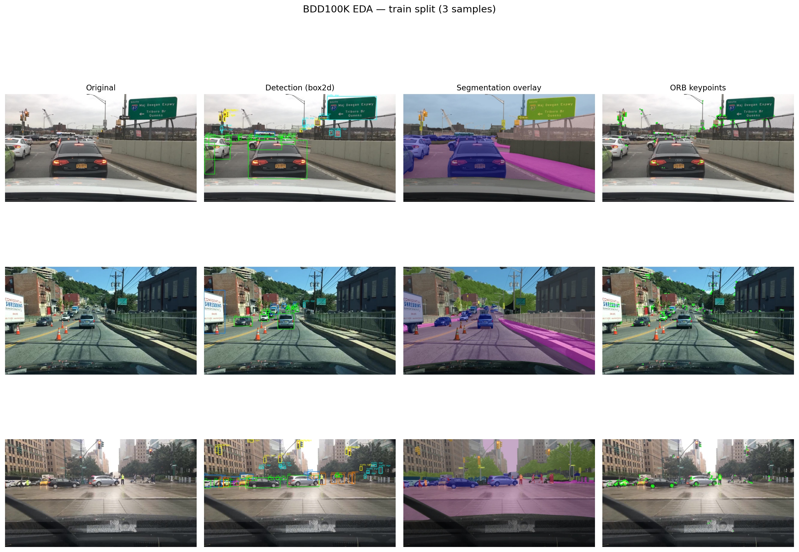

---

## Experimental Protocol and Split Integrity

| Role | Images | Labels used | Used for |
|------|--------|-------------|----------|
| **Robustness evaluation set** | 100 | Detection boxes + seg masks (where needed) | Frozen-model clean / distorted / enhanced runs (ORB, YOLO, SegFormer) |
| **YOLO Fine-Tuning train** | 500 per level | **Bounding boxes** | Domain adaptation training |
| **YOLO Fine-Tuning val** | 100 per level | **Bounding boxes** | FT checkpoint evaluation |
| **SegFormer Fine-Tuning train** | 500 per level | **Semantic masks** | Domain adaptation training |
| **SegFormer Fine-Tuning val** | 100 per level | **Semantic masks** | FT checkpoint evaluation |

| Component | Labels / GT used |
|---|---|
| ORB matching | No external GT; clean image is reference |
| YOLOv8n detection | BDD100K bounding boxes |
| SegFormer-b0 segmentation | BDD100K semantic masks |
| YOLO Fine-Tuning | Detection bounding boxes |
| SegFormer Fine-Tuning | Semantic segmentation masks |

**Comparable vs separate benchmarks**

- **Directly comparable (apples-to-apples):** clean vs distorted vs enhanced vs **fine-tuned** on the **same 100-image robustness set**, for frozen and adapted YOLO and SegFormer (`scripts/eval_finetune_on_robustness.py`).
- **Separate domain-adaptation benchmark:** Fine-Tuned models are also trained on 500 distorted train images and evaluated on **100 held-out distorted val images** per level (disjoint from the robustness set).
- **Interpretation:** Robustness-set FT numbers compare fairly with frozen distorted/enhanced curves; FT-val numbers measure generalization on unseen distorted frames from the same distribution.

**Random split:** Robustness images are sampled with a fixed seed from the train split. FT train/val stems are disjoint subsets of train images with the required labels.

---

## Tasks and Models

**ORB feature matching (low-level)** - Oriented FAST and Rotated BRIEF; up to 500 keypoints; clean image is reference, distorted/enhanced is query; Lowe ratio test 0.75.

**YOLOv8n object detection (high-level)** - COCO-pretrained nano variant; recall @ IoU 0.5 vs BDD100K boxes.

**SegFormer-b0 semantic segmentation (high-level)** - Cityscapes-finetuned; per-image mIoU vs BDD100K index masks (19 classes).

---

## Distortions

All distortions are applied **synthetically** to clean images. Each type is swept over **four intensity levels**.

| Distortion | Enhancement | Core idea |
|------------|-------------|-----------|
| Gaussian noise | NLM | Patch self-similarity averaging |
| Low light | CLAHE | Local contrast lift with noise clip |
| JPEG | Upscale + bilateral | Soften block edges, preserve boundaries |

### Gaussian noise

$$\mathrm{SNR\ (dB)} = 10 \log_{10}\left(\frac{P_{\mathrm{signal}}}{P_{\mathrm{noise}}}\right)$$

**Levels:** 30, 20, 10, 5 dB.

### Low light (gamma)

$$I_{\mathrm{out}} = 255 \cdot \left(\frac{I_{\mathrm{in}}}{255}\right)^{1/\gamma}, \quad \gamma \in (0, 1]$$

**Levels:** γ = 0.75, 0.5, 0.35, 0.2.

### JPEG compression

**Levels:** *Q* = 90, 50, 20, 10.

### Intensity sweep (visual)

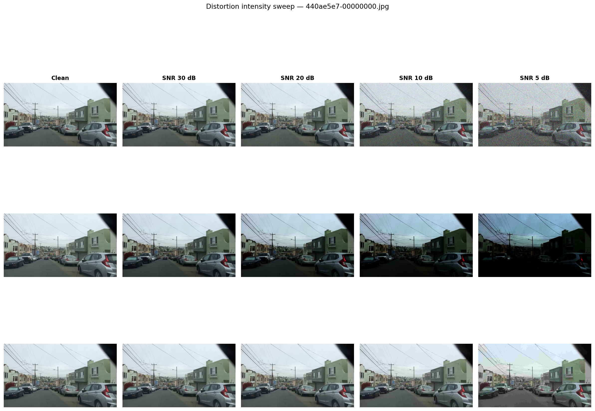

### Preview: clean → distorted → enhanced


*Noise SNR 5 dB, low light γ = 0.2, JPEG *Q* = 10.*

---

## Distortion Severity and Measured SNR / PSNR

Noise levels are defined by **target SNR**. Low light and JPEG use γ and *Q*, but **measured SNR/PSNR** (clean vs distorted) provides a common severity axis. SNR/PSNR is useful but not perfect: structured artifacts (JPEG blocking) can hurt models differently than random noise at similar SNR.

Computed on the **100-image robustness set** (`scripts/compute_distortion_snr_psnr.py`):

| Distortion | Parameter | Mean SNR (dB) | Std | Mean PSNR (dB) | Std | Visual severity |
|---|---|---:|---:|---:|---:|---|
| Noise | SNR 30 dB | 29.9 | 0.15 | 36.9 | 2.41 | Mild grain |
| Noise | SNR 20 dB | 20.1 | 0.12 | 27.1 | 2.59 | Visible noise |
| Noise | SNR 10 dB | 10.7 | 0.20 | 17.7 | 2.60 | Heavy noise |
| Noise | SNR 5 dB | 6.5 | 0.23 | 13.4 | 2.50 | Severe noise |
| Low light | γ = 0.75 | 14.8 | 1.76 | 21.7 | 1.08 | Slightly dark |
| Low light | γ = 0.5 | 7.9 | 1.42 | 14.9 | 1.47 | Under-exposed |
| Low light | γ = 0.35 | 5.2 | 1.18 | 12.1 | 1.77 | Dark |
| Low light | γ = 0.2 | 2.9 | 0.88 | 9.9 | 2.14 | Very dark |
| JPEG | *Q* = 90 | 45.0 | 2.99 | 52.0 | 1.89 | Nearly lossless |
| JPEG | *Q* = 50 | 32.6 | 2.57 | 39.5 | 1.95 | Moderate blocking |
| JPEG | *Q* = 20 | 26.6 | 2.33 | 33.6 | 1.65 | Visible blocks |
| JPEG | *Q* = 10 | 23.0 | 2.28 | 29.9 | 1.37 | Strong blocking |

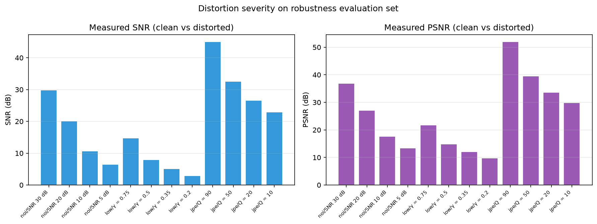

Full CSV: `outputs/tables/distortion_snr_psnr.csv`

---

## Restoration Methods

**NLM (noise)** - patch self-similarity denoising; can blur fine texture and ORB descriptors.

**CLAHE (low light)** - adaptive histogram equalization on L channel in LAB space; lifts shadows but may amplify noise.

**Upscale + bilateral (JPEG)** - deblocking heuristic; cannot recover discarded DCT coefficients.

---

## Evaluation Metrics

**ORB matching ratio**

$$\text{matching ratio} = \frac{N_{\mathrm{matches}}}{N_{\mathrm{keypoints\ on\ clean}}}$$

Good matches pass Lowe's ratio test. **Recovery** = enhanced − distorted. Not classification accuracy; no human-labeled correspondence GT.

**Detection** - recall @ IoU 0.5, precision, mean matched IoU.

$$\mathrm{IoU} = \frac{\text{area of overlap}}{\text{area of union}}$$

**Segmentation** - per-image mIoU: mean IoU over classes present in each image, then averaged across images (not global confusion-matrix mIoU).

---

## Clean Baseline Results

### ORB (*N* = 100)

Clean baseline matching ratio: **1.000** (clean vs clean, by definition).

### YOLOv8n detection (*N* = 100)

| Metric | Value |
|--------|-------|
| Recall @ IoU 0.5 | 0.319 |
| Precision | 0.725 |
| Mean matched IoU | 0.813 |

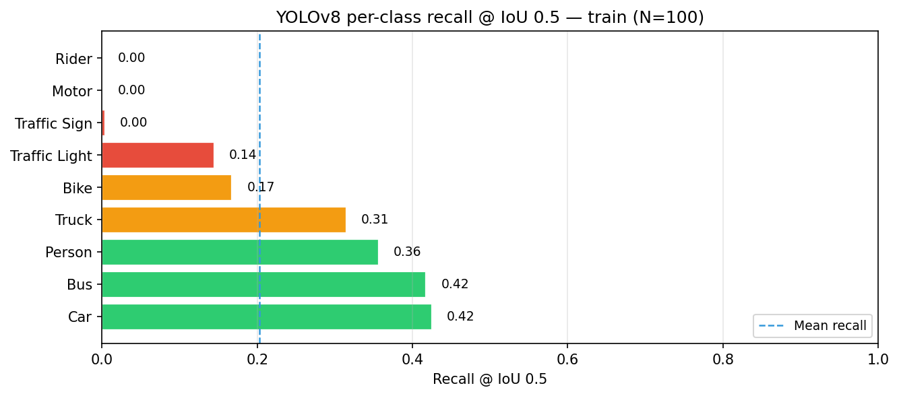

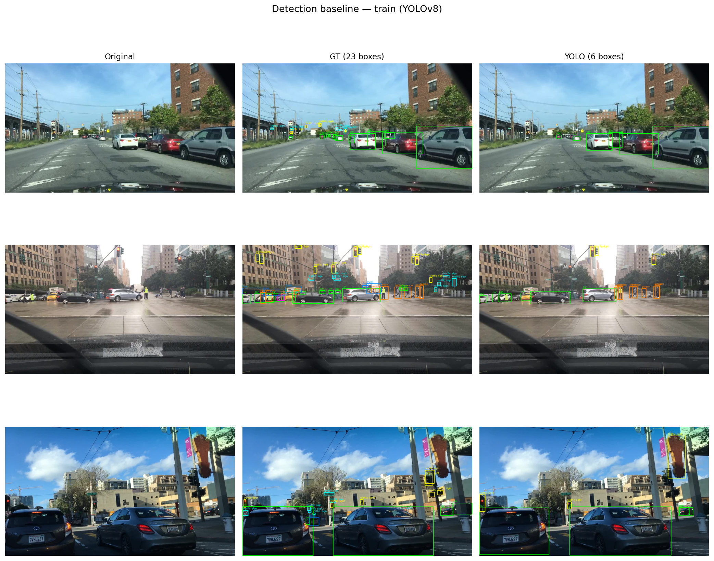

### SegFormer-b0 segmentation (*N* = 100)

**Mean mIoU = 0.469**

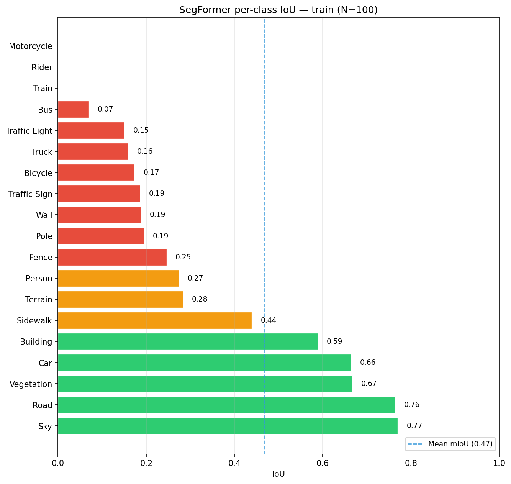

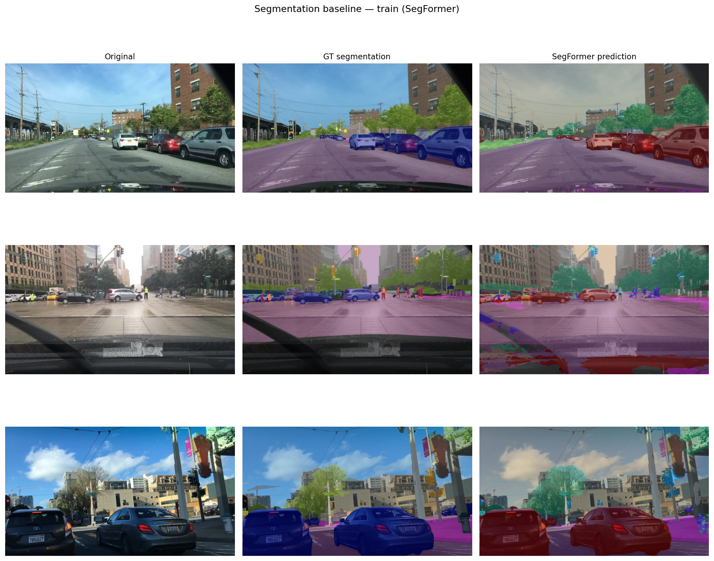

---

## Distorted Results

### ORB matching ratio

| Distortion | Level | Distorted | Enhanced | Recovery |
|------------|-------|-----------|----------|----------|
| Noise | SNR 30 dB | 0.943 | 0.846 | −0.098 |
| Noise | SNR 20 dB | 0.859 | 0.806 | −0.053 |
| Noise | SNR 10 dB | 0.612 | 0.610 | −0.002 |
| Noise | SNR 5 dB | 0.402 | 0.404 | +0.002 |
| Low light | γ = 0.75 | 0.819 | 0.532 | −0.287 |
| Low light | γ = 0.5 | 0.518 | 0.574 | +0.056 |
| Low light | γ = 0.35 | 0.301 | 0.391 | +0.089 |
| Low light | γ = 0.2 | 0.097 | 0.126 | +0.028 |
| JPEG | *Q* = 90 | 0.962 | 0.888 | −0.073 |
| JPEG | *Q* = 50 | 0.896 | 0.869 | −0.027 |
| JPEG | *Q* = 20 | 0.816 | 0.805 | −0.011 |
| JPEG | *Q* = 10 | 0.691 | 0.694 | +0.002 |

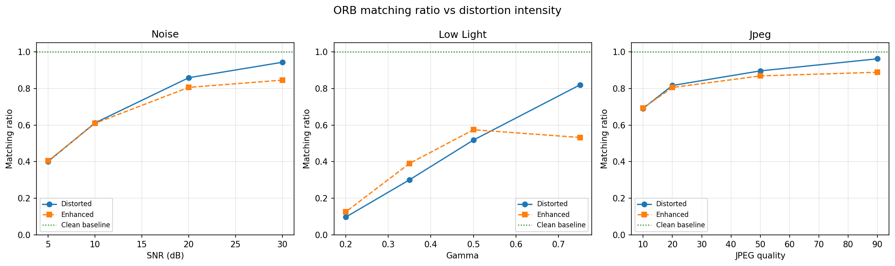

**Analysis.** Gaussian noise corrupts local gradients and texture, reducing descriptor matches monotonically. JPEG removes high-frequency detail. Low light at γ = 0.2 crushes contrast, yielding the lowest matching ratio (0.097).

### YOLOv8n recall (frozen)

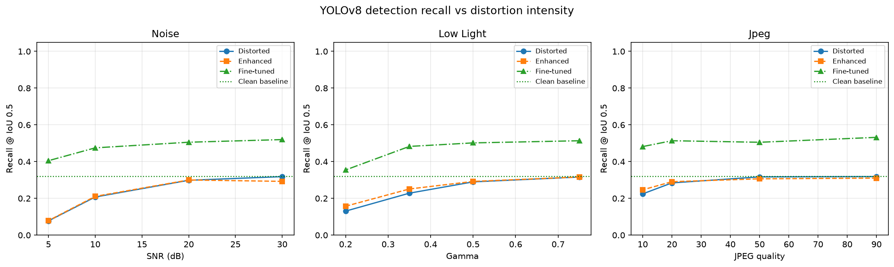

| Distortion | Worst level | Distorted recall |
|---|---|---:|
| Noise | SNR 5 dB | 0.077 |
| Low light | γ = 0.2 | 0.131 |
| JPEG | *Q* = 10 | 0.225 |

**Analysis.** Heavy noise collapses recall because YOLO relies on learned texture and edges that noise destroys. Mild JPEG and low-light shifts are tolerated better than severe noise.

### SegFormer mIoU (frozen)

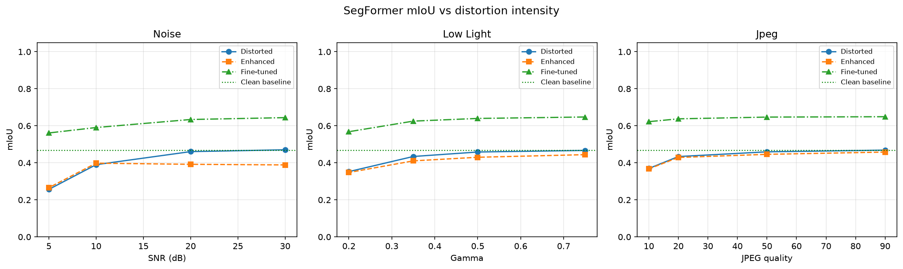

| Distortion | Worst level | Distorted mIoU |
|---|---|---:|
| Noise | SNR 5 dB | 0.257 |
| Low light | γ = 0.2 | 0.353 |
| JPEG | *Q* = 10 | 0.370 |

**Analysis.** SegFormer is most sensitive to noise: pixel boundaries and thin structures blur, dropping mIoU from 0.469 to 0.257 at SNR 5 dB.

---

## Enhanced Results

Enhancement is paired per distortion: NLM (noise), CLAHE (low light), bilateral deblocking (JPEG).

### ORB

CLAHE **improves** low-light matching at γ = 0.35–0.5 (+0.056 to +0.089 recovery). NLM and bilateral **hurt** mild noise and JPEG matching by smoothing binary-descriptor structure.

### YOLOv8n

| Distortion / level | Distorted | Enhanced | Recovery |
|--------------------|-----------|----------|----------|
| Noise SNR 10 dB | 0.207 | 0.211 | +0.004 |
| Noise SNR 5 dB | 0.077 | 0.079 | +0.002 |
| Low light γ = 0.2 | 0.131 | 0.157 | +0.026 |
| JPEG *Q* = 10 | 0.225 | 0.247 | +0.022 |

**Analysis.** Enhancement provides **limited** detection recovery. NLM does not restore YOLO features under heavy noise. CLAHE gives modest low-light gains.

### SegFormer

NLM **hurts** mild-noise mIoU (SNR 30 dB: 0.470 → 0.389, recovery −0.081) by blurring class boundaries. CLAHE and bilateral provide negligible or negative recovery on the robustness set.

---

## Fine-Tuning Results

Fine-Tuning: 500 train / 100 val distorted images per level, 30 epochs. Evaluated on **held-out distorted val** (domain-adaptation benchmark).

### YOLOv8n detection

| Distortion | Level | Pretrained | Enhanced | Fine-Tuned |
|------------|-------|------------|----------|------------|
| Noise | SNR 10 dB | 0.234 | 0.240 | **0.420** |
| Noise | SNR 5 dB | 0.115 | 0.133 | **0.368** |
| Low light | γ = 0.2 | 0.151 | 0.172 | **0.313** |
| JPEG | *Q* = 10 | 0.243 | 0.255 | **0.417** |

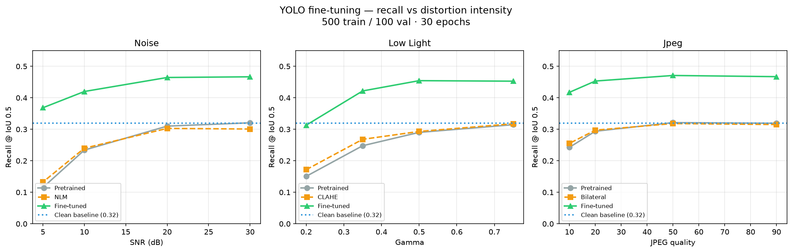

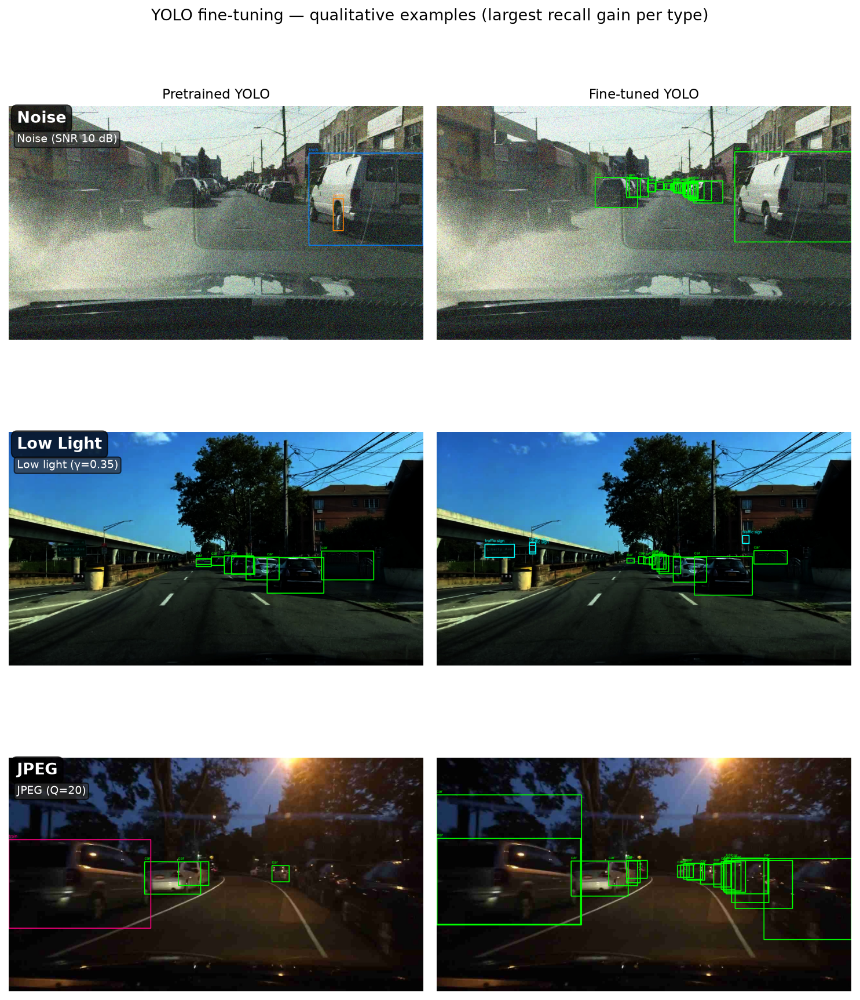

**Analysis.** Fine-Tuning consistently beats pretrained and enhanced recall at all 12 levels on the FT val set. Adaptation learns features robust to the distorted input distribution; blind enhancement cannot.

### Fine-Tuned models on the robustness set (apples-to-apples)

The same FT checkpoints were re-evaluated on the **100-image robustness set** (`scripts/eval_finetune_on_robustness.py`). Robustness plots now include a Fine-Tuned curve alongside Distorted and Enhanced.

| Distortion | Level | Frozen distorted | Enhanced | **Fine-Tuned (robustness set)** |
|------------|-------|------------------|----------|--------------------------------|
| Noise | SNR 5 dB | 0.077 | 0.079 | **0.405** |
| Noise | SNR 10 dB | 0.207 | 0.211 | **0.475** |
| Low light | γ = 0.2 | 0.131 | 0.157 | **0.355** |
| JPEG | *Q* = 10 | 0.225 | 0.247 | **0.482** |

On the shared robustness set, FT recall stays well above frozen distorted/enhanced at severe degradations (e.g. SNR 5 dB: 0.077 → **0.405**).

### SegFormer-b0 segmentation

| Distortion | Level | Pretrained | Enhanced | Fine-Tuned |
|------------|-------|------------|----------|------------|
| Noise | SNR 5 dB | 0.245 | 0.223 (NLM) | **0.454** |
| Noise | SNR 10 dB | 0.377 | 0.332 (NLM) | **0.489** |
| Low light | γ = 0.35 | 0.412 | 0.389 (CLAHE) | **0.494** |
| Low light | γ = 0.2 | 0.335 | 0.320 (CLAHE) | **0.428** |
| JPEG | *Q* = 10 | 0.347 | 0.345 (Bilateral) | **0.487** |

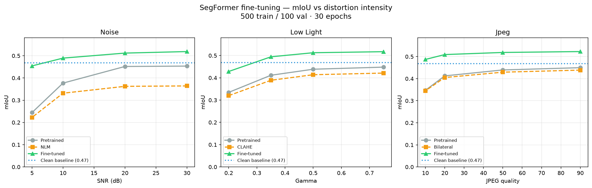

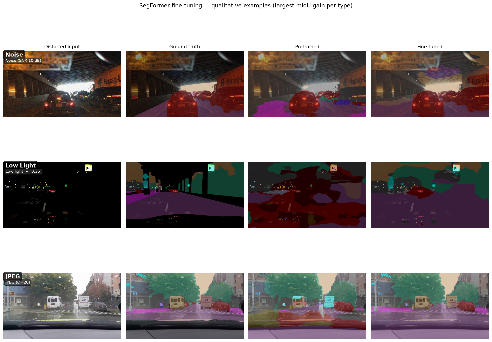

**Analysis.** Fine-Tuning beats frozen pretrained and classical enhancement at every level on the FT val set. NLM hurts mild-noise segmentation; FT recovers boundary information from labeled masks. The γ = 0.35 batch job logged a transient HuggingFace processor error; metrics were recovered from the completed checkpoint (`scripts/patch_seg_batch_summary.py`).

### Fine-Tuned models on the robustness set (apples-to-apples)

| Distortion | Level | Frozen distorted | Enhanced | **Fine-Tuned (robustness set)** |
|------------|-------|------------------|----------|--------------------------------|
| Noise | SNR 5 dB | 0.257 | 0.266 | **0.561** |
| Noise | SNR 10 dB | 0.390 | 0.398 | **0.591** |
| Low light | γ = 0.2 | 0.353 | 0.348 | **0.568** |
| JPEG | *Q* = 10 | 0.370 | 0.368 | **0.622** |

Fine-tuned SegFormer on the robustness set **exceeds the clean baseline** (0.469 mIoU) at several noise and JPEG levels because adaptation specializes on distorted inputs while the frozen Cityscapes model is not optimal for undistorted BDD100K frames in this subset.

---

## Cross-Task Robustness Summary

| Task | Clean baseline | Worst distortion | Distorted | Enhanced | Fine-tuned (robustness set) | Fine-tuned (FT val) | Main conclusion |
|---|---:|---|---:|---:|---:|---:|---|
| ORB matching | 1.000 | Low light γ=0.2 | 0.097 | 0.126 | N/A | N/A | Local appearance most fragile in darkness; CLAHE helps ORB only |
| YOLO recall | 0.319 | Noise SNR 5 dB | 0.077 | 0.079 | **0.405** | 0.368 | Frozen YOLO collapses under noise; FT recovers strongly |
| SegFormer mIoU | 0.469 | Noise SNR 5 dB | 0.257 | 0.266 | **0.561** | 0.454 | Noise blurs boundaries; NLM hurts; FT recovers most loss |

ORB is most sensitive to **local appearance** changes (descriptors, keypoints). YOLO tolerates mild JPEG/low light but **collapses under severe noise** when frozen. SegFormer is sensitive to **boundary smoothing** from noise and denoising but benefits strongly from fine-tuning.

CSV: `outputs/tables/cross_task_robustness_summary.csv`

---

## Per-Class Degradation Analysis

### Clean baseline (from measured results)

**Detection - most robust:** car (0.42), bus (0.42), person (0.36)  
**Detection - most fragile:** traffic sign (0.003), motor/rider (0.0), bike (0.17)

**Segmentation - most robust:** sky (0.77), road (0.76), vegetation (0.67), car (0.66)  
**Segmentation - most fragile:** bus (0.07), pole (0.19), traffic sign (0.19), truck (0.16)

CSVs: `outputs/tables/detection_per_class_clean.csv`, `outputs/tables/segmentation_per_class_clean.csv`, and per-condition exports at SNR 5 dB (`detection_per_class_{distorted,enhanced,finetuned}_noise_snr5.csv`, same for segmentation).

| Task | Distortion | Level | Most robust classes | Most fragile classes | Explanation |
|---|---|---|---|---|---|
| Detection | Noise | SNR 5 dB | car, bus (relative) | traffic sign, bike, rider | Small/thin objects lose contrast and texture first |
| Detection | Low light | γ = 0.2 | car | traffic sign, traffic light | Dark regions hide small objects |
| Segmentation | Noise | SNR 5 dB | road, sky | pole, traffic sign, bus | Large uniform regions survive; thin boundaries break |
| Segmentation | JPEG | *Q* = 10 | road, sky | pole, fence, sign | Blocking hurts edges and fine structures |

Per-class recall/mIoU for distorted, enhanced, and fine-tuned inputs are stored in `outputs/metrics/*_robustness_train.json` and exported via `python scripts/export_report_tables.py`.

---

## Recovery Decision Matrix

| Distortion | Best recovery strategy | Most affected task | Why | Evidence |
|---|---|---|---|---|
| Gaussian noise | **Fine-Tuning** | YOLO + SegFormer | NLM smooths boundaries; FT adapts to noise distribution | YOLO SNR 10: 0.24 → 0.42 FT; Seg SNR 5: 0.25 → 0.45 FT; NLM hurts seg at SNR 30 |
| Low light | **CLAHE for ORB**; **FT for DL** | ORB at moderate γ; DL at γ=0.2 | CLAHE lifts contrast for matching; DL needs adaptation for detection/seg | ORB recovery +0.089 at γ=0.35; YOLO FT 0.313 at γ=0.2 |
| JPEG | **Fine-Tuning** | SegFormer (texture) | Bilateral cannot restore lost frequencies; FT adapts to block artifacts | Seg JPEG Q=10: 0.35 → 0.49 FT; enhancement ≈ 0 |

---

## Visual Enhancement vs Task Performance

A visually cleaner image does not necessarily improve computer-vision metrics. Classical enhancement optimizes appearance or low-level signal quality; downstream models depend on task-specific features. **NLM** reduces visible noise but smooths fine texture and class boundaries, hurting ORB descriptors (recovery −0.098 at SNR 30 dB) and SegFormer mIoU at mild noise (−0.081). **CLAHE** improves ORB low-light matching (+0.089 at γ = 0.35) but does not improve frozen YOLO recall or SegFormer mIoU on the robustness set. **Bilateral deblocking** softens JPEG artifacts visually but cannot recover discarded frequency content; mean segmentation recovery stays near zero. Restoration quality and task-performance recovery must be evaluated **separately**.

---

## Limitations

- Controlled **subset** of BDD100K (100-image robustness set), not official benchmark scores.
- **Synthetic** distortions may not capture all real camera degradations.
- ORB uses **clean-as-reference** matching, not human correspondence ground truth.
- Segmentation mIoU uses **per-image mean**, not global confusion-matrix mIoU.
- **Per-class** metrics on *N* = 100 have high variance for rare classes (traffic sign, rider).
- Course presentation is maintained as a single **Markdown source** ([`PRESENTATION.md`](PRESENTATION.md)); each slide is copy-paste ready for PowerPoint, or render directly with `marp PRESENTATION.md --pptx` / `--pdf`.

---

## Repository Structure

```
DIP/
├── README.md                 # Project report (this file)
├── PRESENTATION.md           # Course presentation (markdown slides)
├── requirements.txt          # Python dependencies
├── 3002_CousreProject.pdf    # Course assignment (local, gitignored)
├── scripts/
│   ├── setup_data.py         # BDD100K layout + YOLO path setup
│   ├── compute_distortion_snr_psnr.py
│   ├── export_report_tables.py
│   ├── eval_finetune_on_robustness.py  # FT checkpoints on robustness set
│   ├── patch_seg_batch_summary.py
│   ├── run_all_detection_finetune.py
│   ├── run_all_segmentation_finetune.py
│   ├── check_gpu.py
│   └── zip_yolo_for_colab.ps1
├── src/
│   ├── run_orb.py            # ORB robustness evaluation
│   ├── run_detection.py      # YOLO baseline / robustness / fine-tune
│   ├── run_segmentation.py   # SegFormer baseline / robustness / fine-tune
│   ├── apply_distortions.py  # Batch distortion + preview figures
│   ├── distortions.py        # Noise, gamma, JPEG synthesis
│   ├── enhancements.py       # NLM, CLAHE, bilateral
│   ├── evaluate.py           # Metrics and plotting
│   ├── yolo_dataset.py       # YOLO fine-tune dataset export
│   └── seg_dataset.py        # SegFormer fine-tune dataset export
├── notebooks/
│   ├── eda.py                # Exploratory data analysis
│   ├── generate_readme_figures.py
│   └── colab_finetune.ipynb
└── outputs/
    ├── figures/              # Plots referenced in README (tracked in git)
    ├── tables/               # CSV report tables
    ├── metrics/              # JSON metrics (local, gitignored)
    └── finetune/             # Training runs + checkpoints (gitignored)
```

**Data (not in git):** download BDD100K to `data/` per § How to Reproduce.

---

## How to Reproduce the Results

### 1. Environment

```powershell
cd C:\DIP
python -m venv .venv
.\.venv\Scripts\Activate.ps1
pip install -r requirements.txt
# GPU: install CUDA-enabled PyTorch if needed
python scripts\check_gpu.py
```

### 2. Data setup

1. Download BDD100K images, labels, and seg maps from [bdd100k.com](https://www.bdd100k.com/).
2. Place zips in project root or run:

```powershell
python scripts\setup_data.py
```

Expected layout: `data/bdd100K_images_10k/10k/train/`, `data/bdd100k_label/100k/`, `data/bdd100k_seg_maps/labels/`.

### 3. EDA and preview figures

```powershell
python notebooks\eda.py
python notebooks\generate_readme_figures.py
```

### 4. Distortions and enhancements

```powershell
python -m src.apply_distortions --split train --also-enhance --preview
```

### 5. ORB evaluation (*N* = 100, seed 42)

```powershell
python -m src.run_orb --split train --num-images 100 --seed 42 --mode all
```

### 6. YOLO detection

```powershell
python -m src.run_detection --mode baseline --split train --num-images 100 --seed 42
python -m src.run_detection --mode robustness --split train --num-images 100 --seed 42
```

### 7. SegFormer segmentation

```powershell
python -m src.run_segmentation --mode baseline --split train --num-images 100 --seed 42
python -m src.run_segmentation --mode robustness --split train --num-images 100 --seed 42
```

### 8. Fine-tuning (GPU)

```powershell
python scripts\run_all_detection_finetune.py
python scripts\run_all_segmentation_finetune.py
python -m src.run_detection --mode finetune-summary
python -m src.run_segmentation --mode finetune-summary
```

### 9. Fine-tuned models on robustness set

Re-evaluate FT checkpoints on the same 100 images as frozen robustness (updates JSON + plots):

```powershell
python scripts\eval_finetune_on_robustness.py --task all
```

### 10. Report tables and SNR/PSNR

```powershell
python scripts\compute_distortion_snr_psnr.py
python scripts\export_report_tables.py
```

**Outputs:** figures in `outputs/figures/`, metrics JSON in `outputs/metrics/`, tables in `outputs/tables/`.

**Hardware:** YOLO fine-tune ~12 jobs × ~10–15 min on RTX-class GPU; SegFormer ~20–60 min per job (batch 2). Total robustness eval ~few hours on 100 images.

**Fixed splits:** robustness *N* = 100, seed 42; FT 500/100 train/val per level.

---

## References

- BDD100K: [https://www.bdd100k.com/](https://www.bdd100k.com/)
- YOLOv8 / Ultralytics: [https://docs.ultralytics.com/](https://docs.ultralytics.com/)
- SegFormer: [https://huggingface.co/nvidia/segformer-b0-finetuned-cityscapes-512-1024](https://huggingface.co/nvidia/segformer-b0-finetuned-cityscapes-512-1024)
- ORB: Rublee et al., ORB: An efficient alternative to SIFT or SURF, ICCV 2011
- Non-Local Means: Buades et al., A non-local algorithm for image denoising, CVPR 2005
- CLAHE: Pizer et al., Adaptive histogram equalization and its variations, CVGIP 1987
- Bilateral filter: Tomasi & Manduchi, Bilateral filtering for gray and color images, ICCV 1998
- JPEG: Wallace, The JPEG still picture compression standard, IEEE 1992
- OpenCV: [https://opencv.org/](https://opencv.org/)
- Hugging Face Transformers: [https://huggingface.co/docs/transformers](https://huggingface.co/docs/transformers)
